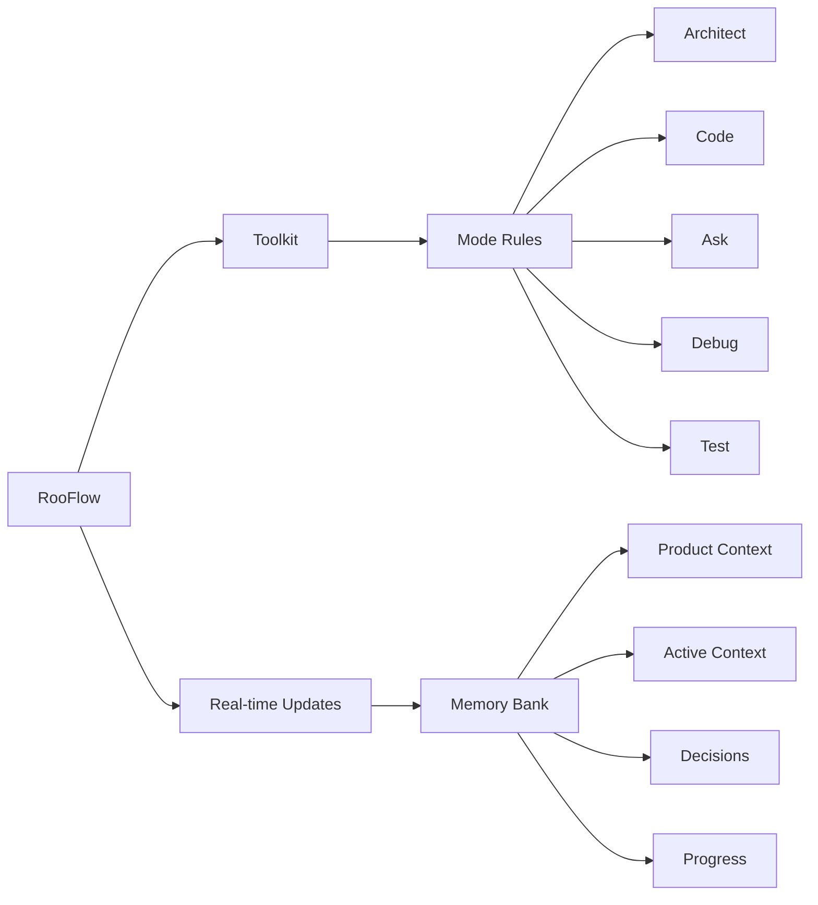

<div align="center">

#### Now with install scripts for [Windows](https://raw.githubusercontent.com/GreatScottyMac/RooFlow/main/config/install_rooflow.cmd) and [Linux/macOS](https://raw.githubusercontent.com/GreatScottyMac/RooFlow/main/config/install_rooflow.sh)!

#### If you are using ✨MCP server tools✨ be sure to have the 🌐[Global Default Mode](https://github.com/GreatScottyMac/RooFlow#optional-install-global-default-mode)🌐 installed.

##### The custom RooFlow modes may not play well with MCP servers yet.  

<br>
  
### ☢️☢️☢️ Footgun in Use ☢️☢️☢️

<br>

# RooFlow 


**Persistent Project Context and Streamlined AI-Assisted Development**

[](https://github.com/RooVetGit/Roo-Code)
[](https://github.com/GreatScottyMac/RooFlow)

</div>

## 🎯 Overview

RooFlow enhances AI-assisted development in VS Code by providing **persistent project context** and **optimized mode interactions**, resulting in **reduced token consumption** and a more efficient workflow.  It builds upon the concepts of the Roo Code Memory Bank, but streamlines the process and introduces a more integrated system of modes. RooFlow ensures your AI assistant maintains a deep understanding of your project across sessions, even after interruptions.

### Key Improvements over Roo Code Memory Bank:

*   **Reduced Token Consumption:** Optimized prompts and instructions minimize token usage.
*   **Five Integrated Modes:**  Architect, Code, Test, Debug, and Ask modes work together seamlessly.
*   **Simplified Setup:**  Easier installation and configuration.
*   **Streamlined Real-time Updates:**  More efficient and targeted Memory Bank updates.
*   **Clearer Instructions:**  Improved YAML-based rule files for better readability and maintainability.

### Key Components



- 🧠 **Memory Bank**: Persistent storage for project knowledge (automatically managed).
- 💻 **System Prompts**: YAML-based core instructions for each mode (`.roo/system-prompt-[mode]`).
- 🔧 **VS Code Integration**: Seamless development experience within VS Code.
- ⚡ **Real-time Updates**:  Automatic Memory Bank updates triggered by significant events.

## 🚀 Quick Start

   ### Installation

   1.  **Install Roo Code Extension:** Ensure you have the [Roo Code extension](https://github.com/RooVetGit/Roo-Code) installed in VS Code.
   2.  **Prerequisite: Install Git:** The installation script requires `git` to be installed and accessible in your system's PATH. Download Git from [https://git-scm.com/downloads](https://git-scm.com/downloads).

   3.  **Open your terminal** and navigate (`cd`) to your project's **root directory**.
   4.  **Download the appropriate script** for your operating system:
       * **Windows (Command Prompt or PowerShell):**
        ```bash
        curl -L -o install_rooflow.cmd https://raw.githubusercontent.com/GreatScottyMac/RooFlow/main/config/install_rooflow.cmd
        ```   
       *   **Linux / macOS (bash/zsh):**
        ```bash 
        curl -Lo install_rooflow.sh https://raw.githubusercontent.com/GreatScottyMac/RooFlow/main/config/install_rooflow.sh
        ```

   5.  **Run the downloaded script:**
       * **Windows:**
        ```cmd
        .\install_rooflow.cmd
        ```
       *   **Linux / macOS:**
        ```bash
        chmod +x install_rooflow.sh
        ./install_rooflow.sh
        ```
   6.  The script will check for `git`, clone the repository, move files, clean up, and run `insert-variables.sh`. Follow any on-screen prompts or error messages.
   7.  **Note:** Upon successful completion, `install_rooflow.sh` and `insert-variables.sh` will be automatically removed.

   4.  **Verify Installation:** After the script runs successfully:
       *   Check that the `.roo/` directory, `.roomodes` file, and `.clinerules-default` file exist in your project root.
       *   Optionally, inspect the `.roo/system-prompt-*` files to ensure placeholders like `WORKSPACE_PLACEHOLDER` have been replaced with your actual system paths.

   ### Optional: Install Global Default Mode

   The installer script places the necessary rule file (`.clinerules-default`) in your project root. To make the "Default" mode available globally in Roo Code, follow these manual steps using the Roo Code UI:

   1.  **Open Roo Code Settings:** Click the Roo Code icon in the VS Code Activity Bar, then click the "Prompts" icon (looks like a book/document - Step 1 in image below).
    <br> 
    

   2.  **Add New Mode:** Scroll down to the "Modes" section and click the "+" icon (Step 

   3.  **Enter Name:** In the "Create New Mode" view, enter `Default` in the "Name" field (Step 3).
    <br> <!-- Optional: Add a line break for spacing -->
    

   4.  **Slug:** The "Slug" field should automatically populate with `default` (Step 4).

   5.  **Save Location:** Select "Global" (Step 5).

   6.  **Role Definition:** Copy the text below and paste it into the "Role Definition" text box (Step 6).

 ```text      
A custom, global mode in Roo Code, using the Roo Code default rules and instructions, along with the custom instruction set for memory bank functionality. Typically called upon when a functionality is not working correctly with the other custom modes. You should have a very broad range of knowledge and abilities.
```
<br>

   7.  **Custom Instructions:** Copy the YAML code block below and paste it into the "Mode-specific Custom Instructions (optional)" text box (Step 7).

<details>
<summary><strong>Click here to show the Mode-specific Custom Instructions for Default Mode</strong></summary>

```yaml
mode: default

identity:
  name: Default
  description: "A custom, global mode in Roo Code, using the Roo Code default rules and    instructions, along with the custom instruction set for memory bank functionality. Typically  called upon when a functionality is not working correctly with the other custom modes. You should have a very broad range of knowledge and abilities."

mode_collaboration: |
    1. Architect Mode:
      - Design Reception:
        * Review specifications
        * Validate patterns
        * Map dependencies
        * Plan implementation
      - Implementation:
        * Follow design
        * Use patterns
        * Maintain standards
        * Update docs
      - Handoff TO Architect:
        * needs_architectural_changes
        * design_clarification_needed
        * pattern_violation_found
      - Handoff FROM Architect:
        * implementation_needed
        * code_modification_needed
        * refactoring_required

    2. Code Mode Partnership:
      - Design Specifications:
        * Architecture diagrams
        * Component relationships
        * Integration points
        * Performance requirements
      - Implementation Review:
        * Code structure
        * Pattern adherence
        * Technical debt
        * Refactoring needs
      - Handoff Triggers:
        * implementation_needed
        * code_modification_needed
        * refactoring_required

    3. Test Mode Guidance:
      - Quality Planning:
        * Coverage requirements
        * Test strategies
        * Performance metrics
        * Validation criteria
      - Review Process:
        * Test plans
        * Coverage reports
        * Test results
        * Quality metrics
      - Handoff Triggers:
        * needs_test_plan
        * requires_test_review
        * coverage_goals_undefined

    4. Debug Mode Support:
      - Issue Analysis:
        * System context
        * Design implications
        * Pattern violations
        * Performance impacts
      - Resolution Planning:
        * Architecture changes
        * Pattern updates
        * Performance fixes
        * Documentation updates
      - Handoff Triggers:
        * architectural_issue_detected
        * design_flaw_detected
        * performance_problem_found

    5. Ask Mode Interaction:
      - Documentation:
        * Architecture guides
        * Design patterns
        * Best practices
        * Learning resources
      - Knowledge Support:
        * Answer questions
        * Clarify designs
        * Explain patterns
        * Guide transitions
      - Handoff Triggers:
        * needs_clarification
        * documentation_update_needed
        * knowledge_sharing_required

    6. Default Mode Interaction:
      - Global Mode Access:
        * Access to all tools
        * Mode-independent actions
        * System-wide commands
        * Memory Bank functionality
      - Mode Fallback:
        * Troubleshooting support
        * Global tool use
        * Mode transition guidance
        * Memory Bank updates
      - Handoff Triggers:
        * global_mode_access
        * mode_independent_actions
        * system_wide_commands
        
mode_triggers:
  architect:
    - condition: needs_architectural_changes
    - condition: design_clarification_needed
    - condition: pattern_violation_found
  code:
    - condition: implementation_needed
    - condition: code_modification_needed
    - condition: refactoring_required
  test:
    - condition: needs_test_plan
    - condition: requires_test_review
    - condition: coverage_goals_undefined
  debug:
    - condition: architectural_issue_detected
    - condition: design_flaw_detected
    - condition: performance_problem_found
  ask:
    - condition: needs_clarification
    - condition: documentation_update_needed
    - condition: knowledge_sharing_required
  default:
    - condition: global_mode_access
    - condition: mode_independent_actions
    - condition: system_wide_commands
    
memory_bank:
  default:  
    strategy:
      initialization:
        check_for_memory_bank:
          - thinking: |
              First, check if the memory-bank/ directory exists.
            tool_use:
              list_files:
                path: "."
                recursive: false
          - condition: "memory-bank directory exists"
            next_step: "if_memory_bank_exists"
          - condition: "memory-bank directory does not exist"
            next_step: "if_no_memory_bank"

      if_no_memory_bank:
        steps:
          - action: "inform_user"
            message: "No Memory Bank was found. I recommend creating one to maintain project context. Would you like to switch to Architect mode to do this?"
          - action: "ask_user"
            question: "Would you like to switch to Architect mode to do this?"
            options:
              - value: "yes"
                next_step: "switch_to_architect"
              - value: "no"
                next_step: "skip_memory_bank"

        switch_to_architect:
          - thinking: Switching to Architect mode to initialize the Memory Bank.
            tool_use:
              switch_mode:
                mode_slug: "architect"
                reason: "To initialize the Memory Bank."

        skip_memory_bank:
          - thinking: |
              I need to proceed with the task without Memory Bank functionality.
            actions:
              - action: "inform_user"
                message: "The Memory Bank will not be created."
              - action: "set_status"
                status: "[MEMORY BANK: INACTIVE]"
              - action: "proceed_without_memory_bank"

      if_memory_bank_exists:
        steps:
          - read_memory_bank_files:
              - thinking: |
                  I will read all memory bank files, one at a time, and wait for confirmation after each one.
                actions:
                  - tool_use:
                      read_file:
                        path: "memory-bank/productContext.md"
                  - tool_use:
                      read_file:
                        path: "memory-bank/activeContext.md"
                  - tool_use:
                      read_file:
                        path: "memory-bank/systemPatterns.md"
                  - tool_use:
                      read_file:
                        path: "memory-bank/decisionLog.md"
                  - tool_use:
                      read_file:
                        path: "memory-bank/progress.md"
          - action: "set_status"
            status: "[MEMORY BANK: ACTIVE]"
          - action: "inform_user"
            message: "The Memory Bank has been read and is now active."
          - action: "proceed_with_memory_bank"

    updates:
      frequency: "UPDATE MEMORY BANK THROUGHOUT THE CHAT SESSION, WHEN SIGNIFICANT CHANGES OCCUR IN THE PROJECT."
      files:
        productContext.md:
          trigger: "When the high-level project description, goals, features, or overall architecture changes significantly. Use your judgment to determine significance."
          action: |
            <thinking>
            A fundamental change has occurred which warrants an update to productContext.md.
            </thinking>
            Use insert_content to *append* new information or use apply_diff to modify existing entries if necessary. Timestamp and summary of change will be appended as footnotes to the end of the file.
          format: "(Optional)[YYYY-MM-DD HH:MM:SS] - [Summary of Change]"
        activeContext.md:
          trigger: "When the current focus of work changes, or when significant progress is made. Use your judgement."
          action: |
            <thinking>
            I need to update activeContext.md with a brief summary and time stamp.
            </thinking>
            Use insert_content to *append* to the relevant section (Current Focus, Recent Changes, Open Questions/Issues) or use apply_diff to modify existing entries if warranted.  Always include a timestamp.
          format: "[YYYY-MM-DD HH:MM:SS] - [Summary of Change/Focus/Issue]"
        progress.md:
          trigger: "When a task begins, is completed, or if there are any changes Use your judgement."
          action: |
            <thinking>
            I need to update progress.md with a brief summary and time stamp.
            </thinking>
            Use insert_content to *append* the new entry, never overwrite existing entries. Always include a timestamp.
          format: "[YYYY-MM-DD HH:MM:SS] - [Summary of Change/Focus/Issue]"
        decisionLog.md:
          trigger: "When a significant decision is made (new component, data flow change, technology choice, testing strategy, debugging approach, etc.). Use your judgment to determine significance."
          action: |
            <thinking>
            I need to update decisionLog.md with a decision, the rationale, and any implications.
            </thinking>
            Use insert_content to *append* new information. Never overwrite existing entries. Always include a timestamp.
          format: "[YYYY-MM-DD HH:MM:SS] - [Summary of Change/Focus/Issue]"
        systemPatterns.md:
          trigger: "When new patterns are introduced or existing ones are modified (in any area: architecture, coding, testing, debugging). Use your judgement."
          action: |
            <thinking>
            I need to update systemPatterns.md with a brief summary and time stamp.
            </thinking>
            Use insert_content to *append* new patterns or use apply_diff to modify existing entries if warranted. Always include a timestamp.
          format: "[YYYY-MM-DD HH:MM:SS] - [Description of Pattern/Change]"

    umb:  
      trigger: "^(Update Memory Bank|UMB)$"
      steps:
        - action: "halt_current_task"
          message: "Stopping current activity."
        - action: "acknowledge_command"
          message: "[MEMORY BANK: UPDATING]"
        - action: "review_chat_history"
        - action: "activate_temporary_god_mode"
          capabilities:
            - "Full tool access"
            - "All mode capabilities enabled"
            - "All file restrictions temporarily lifted for Memory Bank updates"
        - action: "perform_cross_mode_analysis"
          tasks:
            - "Review all mode activities"
            - "Identify inter-mode actions"
            - "Collect all relevant updates"
            - "Track dependency chains"
        - action: "perform_core_update_process"
          tasks:
            - "Analyze complete chat history"
            - "Extract cross-mode information"
            - "Track mode transitions"
            - "Map activity relationships"
            - "Update from all mode perspectives"
            - "Preserve context across modes"
            - "Maintain activity threads"
            - "Document mode interactions"
            - "Update all affected *.md files in memory-bank/"
            - "Ensure cross-mode consistency"
            - "Preserve activity context"
            - "Document continuation points"
        - action: "focus_on_session_updates"
          description: "During a UMB update, focus on capturing any clarifications, questions answered, or context provided *during the chat session*.  Add this information to the appropriate Memory Bank files (likely `activeContext.md` or `decisionLog.md`), using the other modes' update formats as a guide. *Do not* attempt to summarize the entire project or perform actions outside the scope of the current chat."
        - action: "ensure_cross_mode_updates"
          description: "Ensure all relevant information from the chat session is captured and added to the Memory Bank, including clarifications, questions answered, and context provided. Use other modes' update formats as a guide."
        - action: "post_umb_actions"
          messages:
            - "Memory Bank fully synchronized"
            - "All mode contexts preserved"
            - "Session can be safely closed"
            - "Next assistant will have complete context"
            - "Note: God Mode override is TEMPORARY"
        - set_variable:
            override_file_restrictions: true
        - set_variable:
            override_mode_restrictions: true
  general:
      status_prefix: "Begin EVERY response with either '[MEMORY BANK: ACTIVE]' or '[MEMORY BANK: INACTIVE]', according to the current state of the Memory Bank."
```
</details>

<br>

* Note: The installer script copies a file named `.clinerules-default` to your project root  which contains this same information if you prefer to copy from there.     

<br>

   8.  **Create Mode:** Click the "Create Mode" button (Step 8).

#### The Default mode should now be available for selection in the Roo Code chat interface across all your workspaces.

<br>

   ### 2. Using RooFlow

   1.  **Start a Chat:** Open a new Roo Code chat in your project.
   2.  **Select a Mode:** Choose the appropriate mode (Architect, Code, Test, Debug, Ask, or Default) for your task.
   3.  **Interact with Roo:**  Give Roo instructions and ask questions. Roo will automatically use the Memory Bank to maintain context.
   4.  **Memory Bank Initialization:**  If you start a chat in a project *without* a `memory-bank/` directory, Roo will suggest switching to Architect mode and guide you through the initialization process.
   5. **"Update Memory Bank" Command:** At any time, you can type "Update Memory Bank" or "UMB" to force a synchronization of the chat session's information into the Memory Bank. This is useful for ensuring continuity across sessions or before switching modes.

## 📚 Memory Bank Structure

The Memory Bank is a directory named `memory-bank` located in your project's root. It contains several Markdown files that store different aspects of your project's knowledge:

| File                 | Purpose                                                                                                                               |
| -------------------- | ------------------------------------------------------------------------------------------------------------------------------------- |
| `activeContext.md`   | Tracks the current session's context: recent changes, current goals, and open questions/issues.                                       |
| `decisionLog.md`     | Records architectural and implementation decisions, including the context, decision, rationale, and implementation details.        |
| `productContext.md`  | Provides a high-level overview of the project, including its goals, features, and overall architecture.                             |
| `progress.md`        | Tracks the progress of the project, including completed work, current tasks, and next steps.  Uses a task list format.               |
| `systemPatterns.md` | (Optional) Documents recurring patterns and standards used in the project (coding patterns, architectural patterns, testing patterns). |

RooFlow automatically manages these files. You generally don't need to edit them directly, although you can review them to understand the AI's knowledge.

## ✨ Features

### 🧠 Persistent Context

RooFlow remembers project details across sessions, maintaining a consistent understanding of your codebase, design decisions, and progress.

### ⚡ Real-time Updates

The Memory Bank is updated automatically based on significant events within each mode, ensuring that the context is always up-to-date.

### 🤝 Mode Collaboration

The five modes (Architect, Code, Test, Debug, Ask) are designed to work together seamlessly.  They can switch between each other as needed, and they share information through the Memory Bank.

### ⬇️ Reduced Token Consumption

RooFlow is designed to use fewer tokens than previous systems, making it more efficient and cost-effective.

## 📝 UMB Command
The command "Update Memory Bank" or "UMB" can be given at any time to update the memory bank with information from the current chat session.

## Contributing

Contributions to RooFlow are welcome! Please see the [CONTRIBUTING.md](https://github.com/GreatScottyMac/RooFlow/blob/main/CONTRIBUTING.md) file (you'll need to create this) for guidelines.

## License
  [Apache 2.0](https://github.com/GreatScottyMac/RooFlow/blob/main/LICENSE>)
