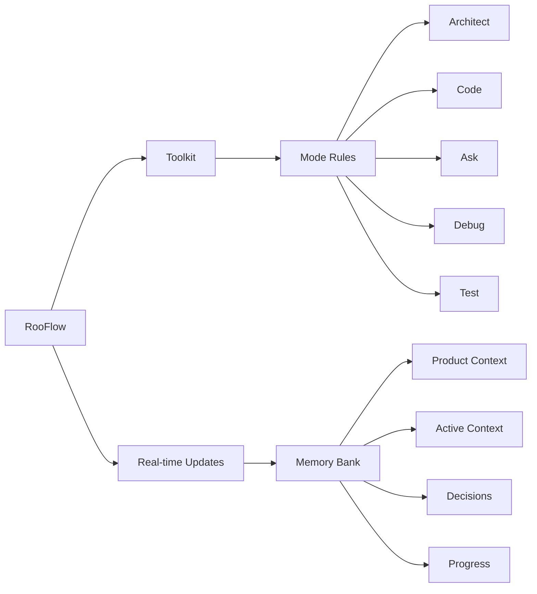

<div align="center">

# 🧠 RooFlow

**Persistent Project Context and Streamlined AI-Assisted Development**

[](https://github.com/RooVetGit/Roo-Code)
[]([INSERT_YOUR_ROOFLOW_REPO_LINK_HERE])

</div>

## 🎯 Overview

RooFlow enhances AI-assisted development in VS Code by providing **persistent project context** and **optimized mode interactions**, resulting in **reduced token consumption** and a more efficient workflow.  It builds upon the concepts of the Roo Code Memory Bank, but streamlines the process and introduces a more integrated system of modes. RooFlow ensures your AI assistant maintains a deep understanding of your project across sessions, even after interruptions.

### Key Improvements over Roo Code Memory Bank:

*   **Reduced Token Consumption:** Optimized prompts and instructions minimize token usage.
*   **Five Integrated Modes:**  Architect, Code, Test, Debug, and Ask modes work together seamlessly.
*   **Simplified Setup:**  Easier installation and configuration.
*   **Streamlined Real-time Updates:**  More efficient and targeted Memory Bank updates.
*   **Clearer Instructions:**  Improved YAML-based rule files for better readability and maintainability.

### Key Components



- 🧠 **Memory Bank**: Persistent storage for project knowledge (automatically managed).
- 📋 **Mode Rules**: YAML-based configuration for each mode's behavior (`.clinerules-[mode]`).
- 💻 **System Prompts**: YAML-based core instructions for each mode (`.roo/system-prompt-[mode]`).
- 🔧 **VS Code Integration**: Seamless development experience within VS Code.
- ⚡ **Real-time Updates**:  Automatic Memory Bank updates triggered by significant events.

## 🚀 Quick Start

### 1. Installation

1.  **Install Roo Code Extension:** Ensure you have the Roo Code extension installed in VS Code.
2.  **Download RooFlow Files:** Download the following files from this repository:
    *   `.clinerules-architect`
    *   `.clinerules-code`
    *   `.clinerules-debug`
    *   `.clinerules-ask`
    *   `.clinerules-test`
    *   `system-prompt-architect`
    *   `system-prompt-code`
    *   `system-prompt-debug`
    *   `system-prompt-ask`
    *  `system-prompt-test`
    *   `.roomodes`
3.  **Place Files in Project:**
    *   Place the `.clinerules-[mode]` files in your project's **root** directory.
    *   Create a directory named `.roo` in your project's root directory.
    *   Place the `system-prompt-[mode]` files inside the `.roo` directory.
    * Place the `.roomodes` file in the project's root directory.

Your project structure should look like this:

```
project-root/
├── .clinerules-architect
├── .clinerules-code
├── .clinerules-debug
├── .clinerules-ask
├── .clinerules-test
├── .roomodes
├── .roo/
│   ├── system-prompt-architect
│   ├── system-prompt-code
│   ├── system-prompt-debug
│   ├── system-prompt-ask
│   └── system-prompt-test
└── memory-bank/  (This directory will be created automatically)
    ├── activeContext.md
    ├── productContext.md
    ├── progress.md
    └── decisionLog.md
```

4. **Configure VS Code Settings:**
   *  Leave the "Custom Instructions" text boxes **empty** in the Roo Code Prompts section of your VS Code settings. RooFlow uses file-based configuration.

### 2. Using RooFlow

1.  **Start a Chat:** Open a new Roo Code chat in your project.
2.  **Select a Mode:** Choose the appropriate mode (Architect, Code, Test, Debug, Ask) for your task.
3.  **Interact with Roo:**  Give Roo instructions and ask questions. Roo will automatically use the Memory Bank to maintain context.
4.  **Memory Bank Initialization:**  If you start a chat in a project *without* a `memory-bank/` directory, Roo (in Architect or Code mode) will guide you through the initialization process.
5. **"Update Memory Bank" Command:** At any time, you can type "Update Memory Bank" or "UMB" to force a synchronization of the chat session's information into the Memory Bank. This is useful for ensuring continuity across sessions or before switching modes.

## 📚 Memory Bank Structure

The Memory Bank is a directory named `memory-bank` located in your project's root. It contains several Markdown files that store different aspects of your project's knowledge:

| File                 | Purpose                                                                                                                               |
| -------------------- | ------------------------------------------------------------------------------------------------------------------------------------- |
| `activeContext.md`   | Tracks the current session's context: recent changes, current goals, and open questions/issues.                                       |
| `decisionLog.md`     | Records architectural and implementation decisions, including the context, decision, rationale, and implementation details.        |
| `productContext.md`  | Provides a high-level overview of the project, including its goals, features, and overall architecture.                             |
| `progress.md`        | Tracks the progress of the project, including completed work, current tasks, and next steps.  Uses a task list format.               |
| `systemPatterns.md` | (Optional) Documents recurring patterns and standards used in the project (coding patterns, architectural patterns, testing patterns). |

RooFlow automatically manages these files. You generally don't need to edit them directly, although you can review them to understand the AI's knowledge.

## ✨ Features

### 🧠 Persistent Context

RooFlow remembers project details across sessions, maintaining a consistent understanding of your codebase, design decisions, and progress.

### ⚡ Real-time Updates

The Memory Bank is updated automatically based on significant events within each mode, ensuring that the context is always up-to-date.

### 🤝 Mode Collaboration

The five modes (Architect, Code, Test, Debug, Ask) are designed to work together seamlessly.  They can switch between each other as needed, and they share information through the Memory Bank.

### 🛠️ Customizable Behavior

The `.clinerules-[mode]` files allow you to customize the behavior of each mode, tailoring it to your specific project needs and workflow.

### ⬇️ Reduced Token Consumption

RooFlow is designed to use fewer tokens than previous systems, making it more efficient and cost-effective.

## 📝 UMB Command
The command "Update Memory Bank" or "UMB" can be given at any time to update the memory bank with information from the current chat session.

## ℹ️ Troubleshooting

*   **Memory Bank Not Found:** If Roo doesn't seem to be using the Memory Bank, make sure the `memory-bank/` directory exists in your project root and that the core files are present. You can try switching to Architect mode and saying "hello" to trigger the initialization process.
*   **Unexpected Behavior:** If Roo is behaving unexpectedly, check the `.clinerules-[mode]` files for any errors or unintended instructions.
* **First Tool Call Display**: The system is set up to show the first tool use, this cannot be prevented.

## Contributing

Contributions to RooFlow are welcome! Please see the [CONTRIBUTING.md](CONTRIBUTING.md) file (you'll need to create this) for guidelines.

## License
  [Apache 2.0](LICENSE)

---
```
