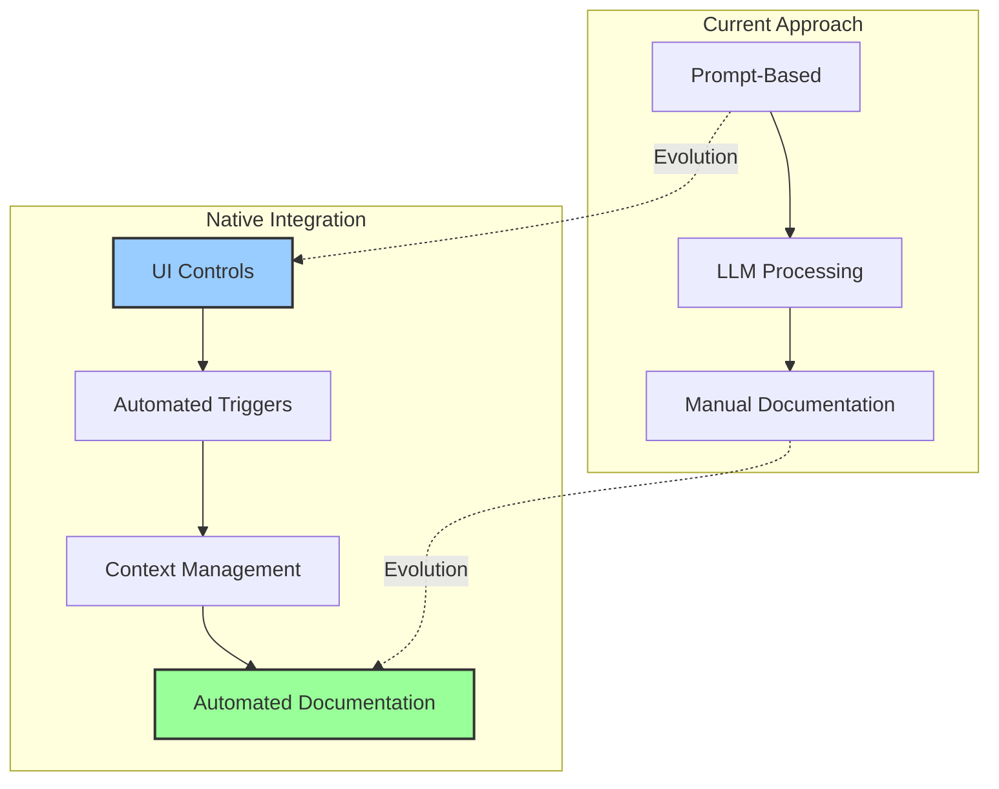
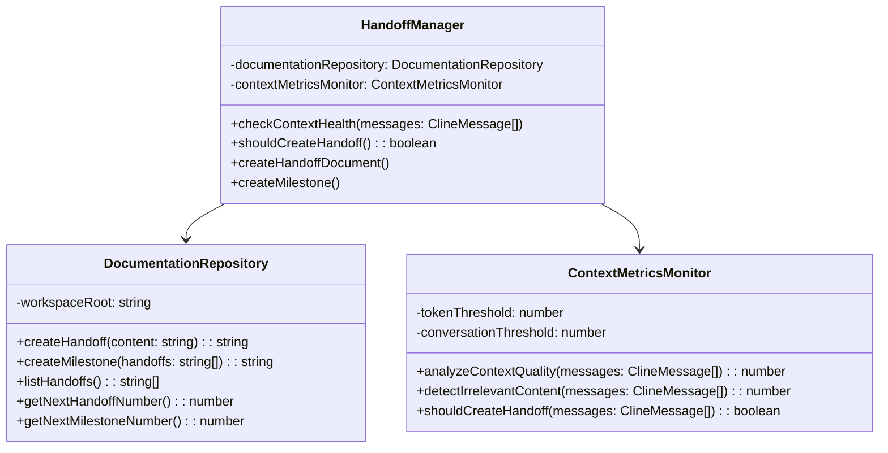
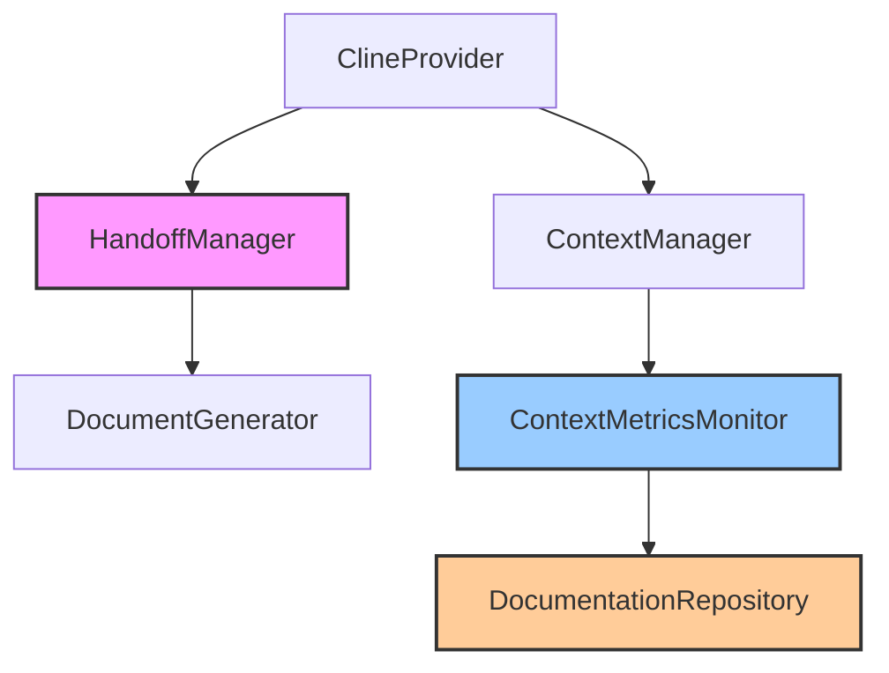
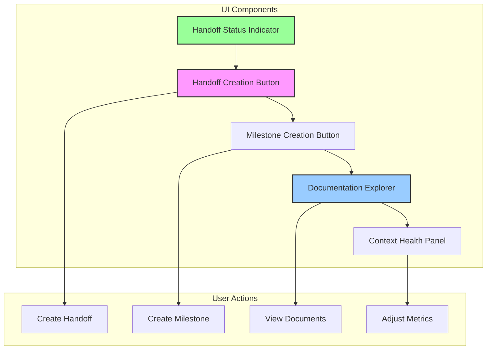
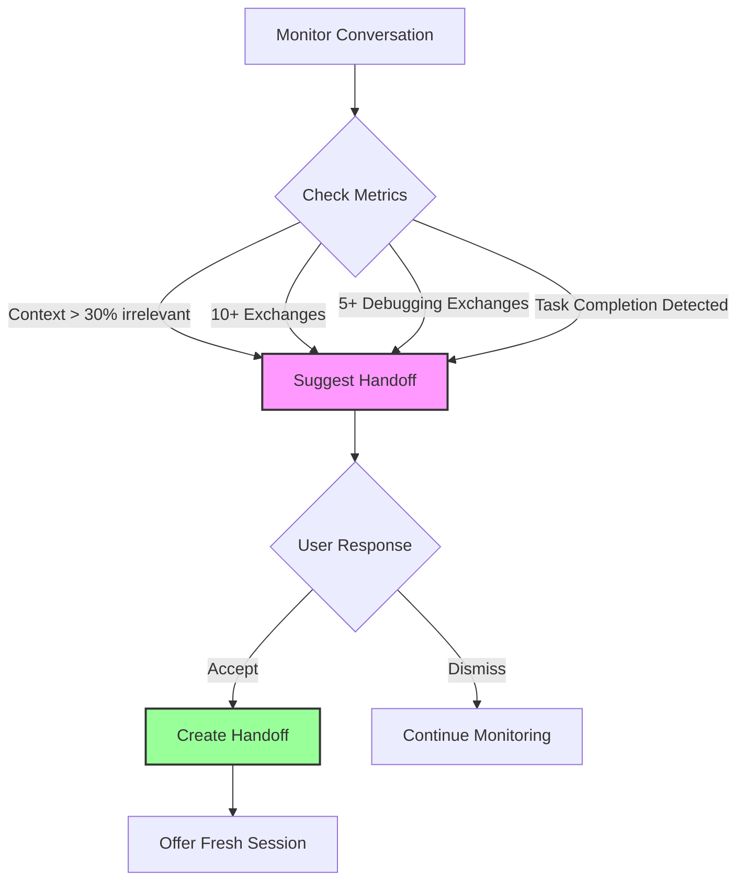
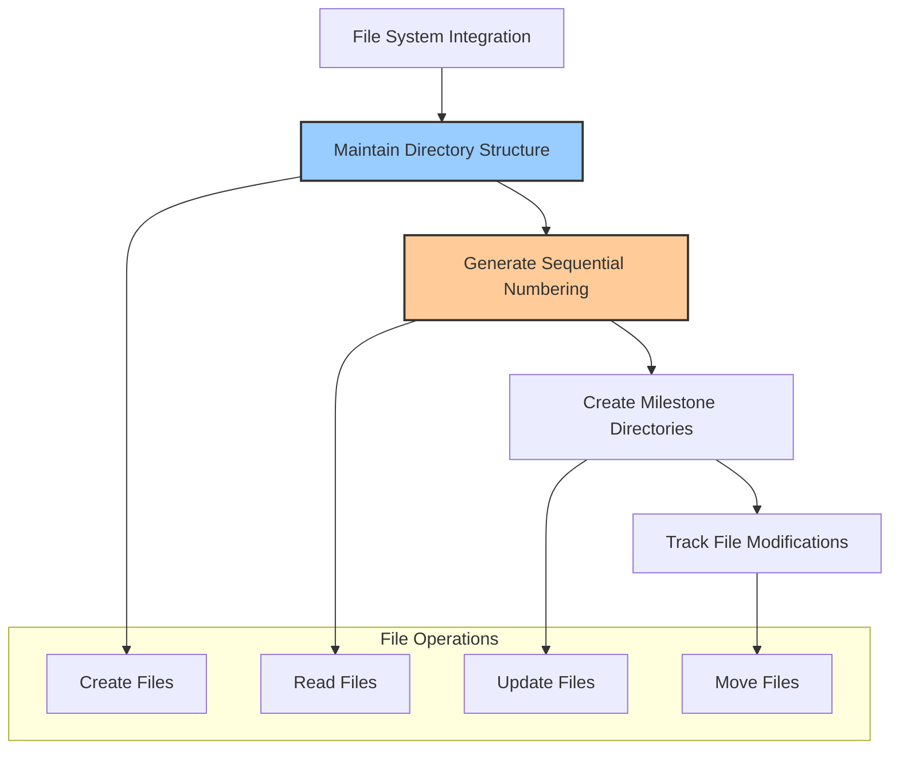
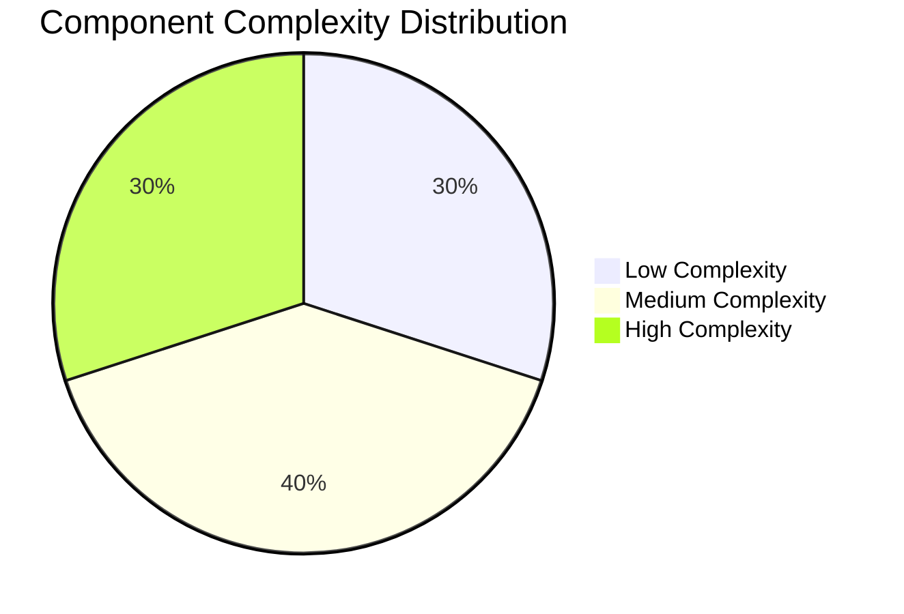
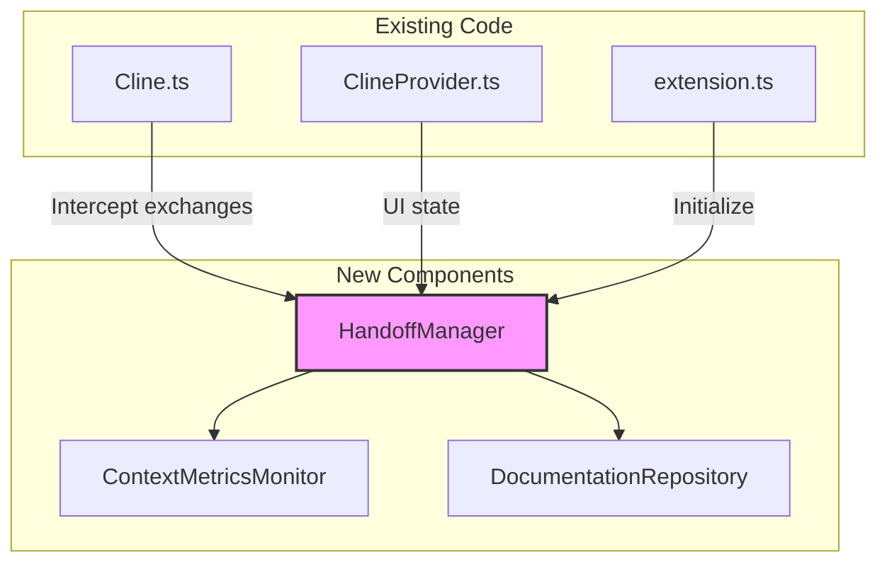
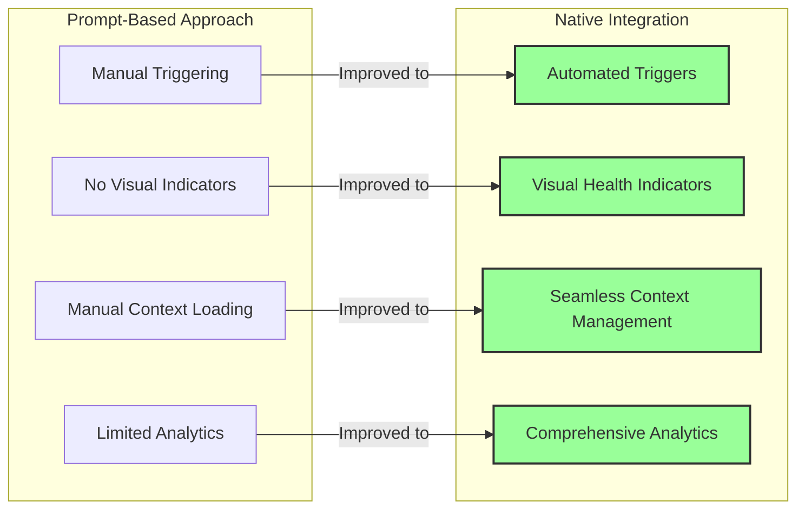
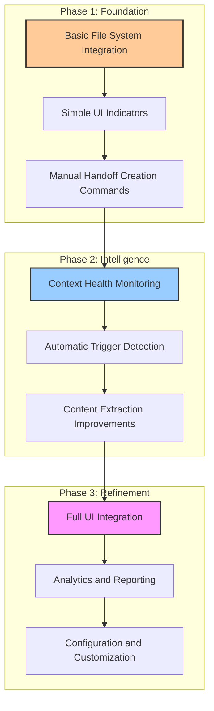

# Theoretical Integration of Handoff System into Roo-Code

This document explores the theoretical implementation of the Handoff System as a native feature within the Roo-Code VS Code extension. This is purely speculative and intended to assess the feasibility and complexity of such an integration.

## Conceptual Overview

Integrating the Handoff System directly into Roo-Code would transform it from a prompt-based pattern into a first-class feature with dedicated UI controls, automated triggers, and seamless context management.



## Implementation Components

### 1. Core Architecture Extensions

The Roo-Code extension would need several architectural additions:

- **HandoffManager Class**: A new service to track conversation state, detect handoff triggers, and manage handoff/milestone documents
- **DocumentationRepository**: Storage system for handoffs and milestones, with versioning capabilities
- **ContextMetricsMonitor**: Enhanced analytics to detect context degradation based on token usage, conversation turns, etc.



Integration with existing components:



### 2. UI Components

New UI elements would be required:



- **Handoff Status Indicator**: Visual indicator showing context health (green/yellow/red) in the sidebar
- **Handoff Creation Button**: One-click generation of handoff documents
- **Milestone Creation Button**: Assistant for milestone creation with directory management
- **Documentation Explorer**: Tree view of handoffs and milestones in the sidebar
- **Context Health Panel**: Detailed metrics about context usage and recommendations

### 3. Automatic Triggers

The system would monitor for handoff triggers:



- Context degradation detection (30% irrelevant threshold)
- Conversation turn counter (10+ exchanges)
- Debugging detection (5+ exchanges without resolution)
- Task completion detection (natural language processing to identify achievements)

### 4. File System Integration

The extension would need to:



- Automatically maintain the handoffs/ directory structure
- Generate sequentially numbered files
- Create milestone directories when appropriate
- Track file modifications through the VS Code workspace API

## Implementation Complexity Assessment



### Low Complexity Components

- **Basic file system operations**: Creating directories and files
- **Simple UI indicators**: Status icons and basic buttons
- **Static documentation generation**: Templates for handoffs

### Medium Complexity Components

- **Context monitoring system**: Tracking token usage and conversation metrics
- **Document explorer UI**: Tree view with navigation
- **Handoff trigger detection**: Basic algorithms for detecting when handoffs should occur

### High Complexity Components

- **Intelligent content extraction**: Automatically determining what should go in handoff sections
- **Context quality analysis**: Sophisticated algorithms to determine context relevance
- **Seamless LLM session transition**: Maintaining coherence across fresh LLM sessions

## Integration Points with Existing Code



The handoff system would need to hook into several existing Roo-Code components:

1. **Cline.ts**: To intercept conversation exchanges and monitor context usage
   ```typescript
   // Approximate integration point in Cline.ts
   async recursivelyMakeClineRequests(...) {
     // Existing code
     
     // New handoff system hooks
     await this.handoffManager.checkContextHealth(this.clineMessages);
     if (this.handoffManager.shouldCreateHandoff()) {
       await this.handoffManager.promptForHandoff();
     }
     
     // Continue with existing code
   }
   ```

2. **ClineProvider.ts**: To manage the UI state and buttons
   ```typescript
   // UI state extension
   interface State {
     // Existing state
     handoffSystem: {
       contextHealth: 'good' | 'warning' | 'critical',
       pendingHandoffs: boolean,
       lastHandoffDate?: number
     }
   }
   ```

3. **Extension activation**: To initialize the handoff system
   ```typescript
   export function activate(context: vscode.ExtensionContext) {
     // Existing initialization
     
     // Initialize handoff system
     const handoffManager = new HandoffManager(context, outputChannel);
     context.subscriptions.push(handoffManager);
     
     // Continue with existing code
   }
   ```

## Benefits of Native Integration



Compared to the current prompt-based approach:

1. **Reduced Cognitive Load**: Users don't need to remember when to create handoffs
2. **Consistency**: Automated triggers ensure handoffs are created at optimal times
3. **Visualization**: UI indicators make context health visible at a glance
4. **Seamless Transitions**: One-click handoff creation without prompts
5. **Analytics**: Track project progress and documentation quality

## Challenges and Considerations

1. **Balancing Automation vs. Control**: Too many automatic prompts could become annoying
2. **Performance Overhead**: Continuous monitoring needs to be efficient
3. **User Experience Design**: Making the system helpful without being intrusive
4. **Configuration Options**: Different users will want different thresholds and behaviors
5. **Cross-Editor Compatibility**: Ensuring handoffs work with other editors in the future

## Phased Implementation Approach



### Phase 1: Foundation
- Basic file system integration
- Simple UI indicators
- Manual handoff creation through commands

### Phase 2: Intelligence
- Context health monitoring
- Automatic trigger detection
- Content extraction improvements

### Phase 3: Refinement
- Full UI integration
- Analytics and reporting
- Configuration and customization

## Conclusion

Integrating the Handoff System directly into Roo-Code represents a medium to high complexity project but would provide significant value by transforming a manual process into an intelligent assistant feature. The most challenging aspects revolve around the automatic content generation and context quality analysis.

The implementation could be approached incrementally with basic functionality delivered first, followed by more sophisticated features in later phases. Given the architecture of Roo-Code, the integration is technically feasible without major restructuring, making this an attractive potential enhancement for future versions.

## Related Resources

- [Handoff System Architecture](handoff-system.md) - Comprehensive documentation of the handoff system
- [Handoff System Quick Start Guide](handoff-system-guide.md) - Step-by-step implementation instructions
- [Lightweight Integration Proposal](roo-code-lightweight-integration.md) - Simpler integration approach