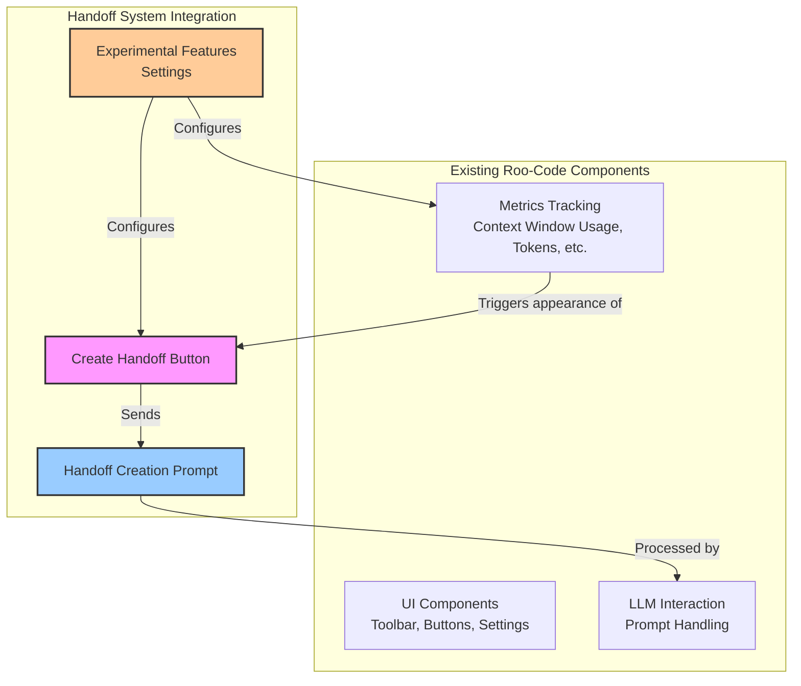
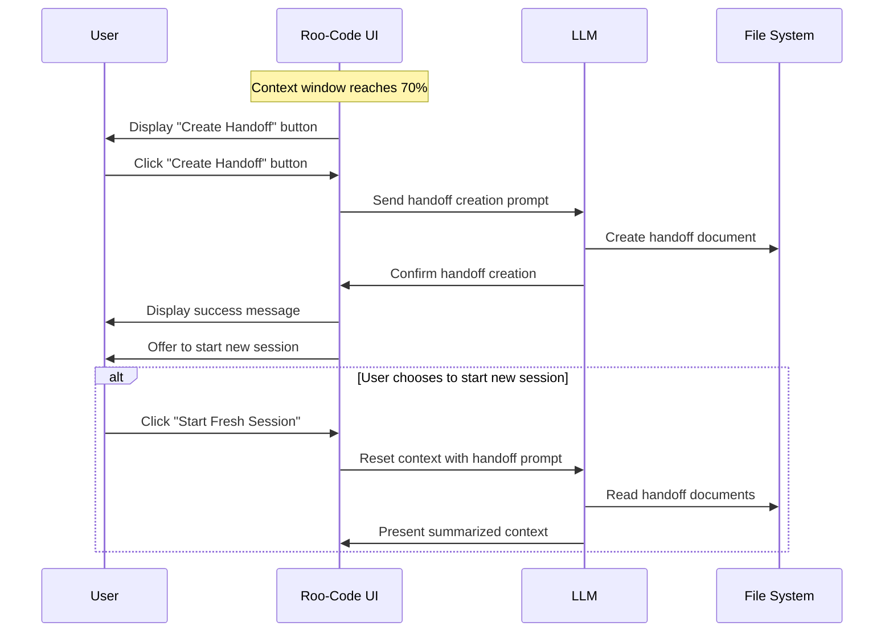
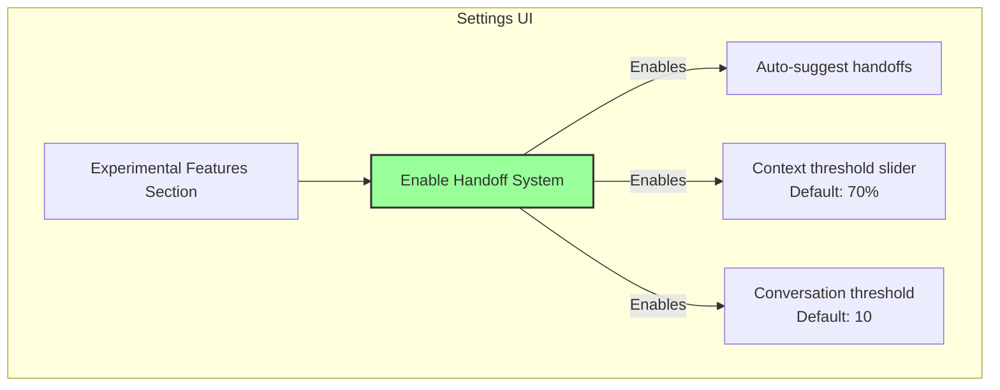
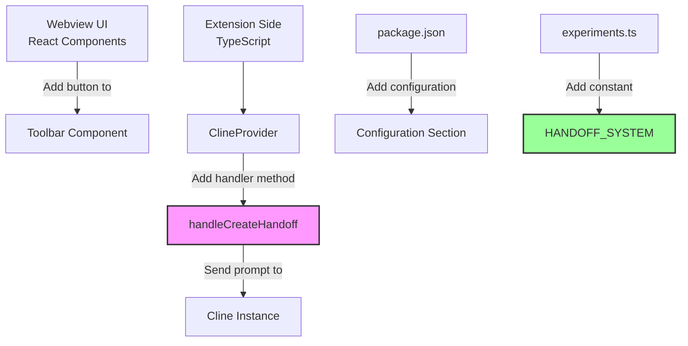
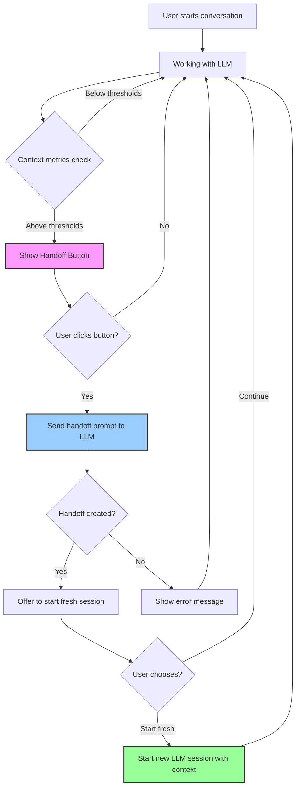

# Lightweight Handoff System Integration for Roo-Code

## Overview

Rather than a full native integration, Roo-Code could implement a lightweight integration of the handoff system that leverages existing metrics tracking and UI infrastructure. This approach would require minimal changes to the codebase while providing the core benefits of the handoff system.



## The Metrics Hook Opportunity

Roo-Code already tracks detailed metrics about the conversation:
- Tokens in/out
- Context window usage percentage
- Cache usage
- API cost

These metrics provide perfect triggers for the handoff system without requiring additional monitoring infrastructure.

## Implementation Concept

### 1. Add a "Create Handoff" Button

Add a simple button to the Roo-Code UI that becomes visible/highlighted when certain thresholds are reached:
- Context window usage exceeds 70%
- Conversation exchange count exceeds 10
- Certain time thresholds are met



### 2. Handoff Creation Flow

When the user clicks the button:

1. The system sends a specific prompt to the LLM:
```
I need to create a handoff document for our current work. Please:
1. Read the docs/handoffs/0-instructions/1-handoff-instructions.md
2. Determine the next sequential handoff number by examining ONLY the handoffs/ root directory
3. Create a properly structured handoff file with that number
```

2. The LLM analyzes the current conversation history and creates the handoff document
3. After creation, Roo-Code offers to start a new session with the milestone context loaded

### 3. Simple UI Enhancements

A few simple UI elements would make the system more effective:
- Context health indicator (green/yellow/red) in the sidebar
- Handoff button that appears when thresholds are met
- Milestone creation option in the dropdown menu
- Session reset button that preserves handoff context

### 4. Experimental Feature in Settings

Add the handoff system as an experimental feature in the Settings menu:



```typescript
// In package.json configuration section
"configuration": {
  "title": "Roo Code",
  "properties": {
    // Existing properties...
    "roo-cline.experiments.handoffSystem": {
      "type": "boolean",
      "default": false,
      "description": "Enable Handoff System for managing context window and creating project documentation"
    },
    "roo-cline.handoffSystem.contextThreshold": {
      "type": "number",
      "default": 70,
      "description": "Context window percentage threshold for suggesting handoff (30-90)",
      "minimum": 30,
      "maximum": 90
    },
    "roo-cline.handoffSystem.conversationThreshold": {
      "type": "number",
      "default": 10,
      "description": "Conversation exchanges threshold for suggesting handoff",
      "minimum": 5,
      "maximum": 20
    },
    "roo-cline.handoffSystem.autoSuggest": {
      "type": "boolean",
      "default": true,
      "description": "Show notification when handoff thresholds are reached"
    }
  }
}
```

The Settings UI would display these options under an "Experimental Features" section:

- [x] Enable Handoff System
- [ ] Auto-suggest handoffs when thresholds reached
- Context threshold: [70%] (slider)
- Conversation threshold: [10] (slider)

When the user enables the handoff system, Roo-Code would automatically check for a `handoffs/` directory in the project root and offer to set up the necessary files if they don't exist.

## Code Integration Points

The integration would require minimal changes to the Roo-Code codebase:



1. In the webview UI (React):
```jsx
// Add to the toolbar component
{isHandoffSystemEnabled && contextPercentage > handoffContextThreshold && (
  <Button 
    icon="document-create" 
    tooltip="Create Handoff Document" 
    onClick={handleCreateHandoff} 
  />
)}
```

2. In the extension side:
```typescript
// New handler in ClineProvider
async handleCreateHandoff() {
  const handoffPrompt = `I need to create a handoff document for our current work. Please:
1. Read the docs/handoffs/0-instructions/1-handoff-instructions.md
2. Determine the next sequential handoff number by examining ONLY the handoffs/ root directory
3. Create a properly structured handoff file with that number`;

  // Send the handoff creation prompt
  const cline = this.getCline();
  if (cline) {
    await cline.ask("text", handoffPrompt);
  }
}

// For auto-suggestions
private checkHandoffThresholds() {
  if (!this.state.experiments?.handoffSystem || !this.state.handoffSystem?.autoSuggest) {
    return;
  }
  
  const contextPercentage = (this.metrics.contextTokens / this.metrics.contextWindow) * 100;
  const conversationCount = this.clineMessages.filter(m => m.type === "ask").length;
  
  if (contextPercentage > this.state.handoffSystem.contextThreshold || 
      conversationCount > this.state.handoffSystem.conversationThreshold) {
    vscode.window.showInformationMessage(
      "Context window is getting full. Create a handoff?",
      "Create Handoff", "Ignore"
    ).then(selection => {
      if (selection === "Create Handoff") {
        this.handleCreateHandoff();
      }
    });
  }
}
```

3. Add to experiments list in the shared/experiments.ts file:
```typescript
export const EXPERIMENT_IDS = {
  // Existing experiments
  DIFF_STRATEGY: 'diffStrategy',
  POWER_STEERING: 'powerSteering',
  // New experiment
  HANDOFF_SYSTEM: 'handoffSystem'
} as const;
```

## Advantages of the Lightweight Approach

1. **Minimal Code Changes**: Uses existing metrics tracking and UI frameworks
2. **User Control**: Handoffs are suggested but not automatic, maintaining user agency
3. **Gradual Adoption**: Users can try the system without committing to a complex workflow
4. **Extension Points**: Can be enhanced incrementally over time
5. **Prompt-Based**: Leverages the LLM's own capabilities rather than rebuilding logic in code
6. **Configurable**: Users can adjust thresholds to match their workflow

## User Experience Flow



## Additional Enhancement Ideas

Once the basic functionality is in place, simple enhancements could be added:

1. **Recent Handoffs View**: Small sidebar panel showing recent handoff documents
2. **Context Reset Button**: Quick way to start fresh with handoff context loaded
3. **Auto-Suggestions**: Toast notifications when thresholds are reached
4. **Handoff Statistics**: Track handoff frequency and project documentation coverage
5. **Handoff Explorer**: Tree view in the sidebar showing handoffs and milestones

## Conclusion

This lightweight integration approach provides most of the benefits of the handoff system with a fraction of the implementation complexity. By leveraging Roo-Code's existing metrics tracking and using the LLM's own analytical capabilities, the system can be implemented with minimal code changes while still providing significant value to users.

The approach remains true to the "let the LLM do the work" philosophy, using the model's capabilities to analyze conversations and create appropriate documentation rather than reimplementing this logic in the extension code.

By adding it as an experimental feature, users can opt-in to try the functionality while it's being refined, providing valuable feedback for future improvements without disrupting existing workflows.

## Related Resources

- [Handoff System Architecture](handoff-system.md) - Comprehensive documentation of the handoff system
- [Handoff System Quick Start Guide](handoff-system-guide.md) - Step-by-step implementation instructions
- [Comprehensive Integration Architecture](roo-code-handoff-integration-theory.md) - Theoretical full native integration