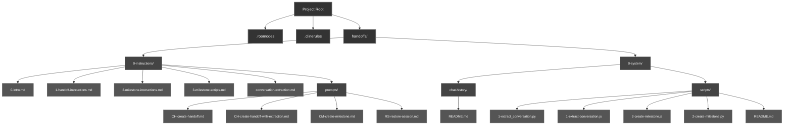

# Advanced Installation Guide

## Overview

The Advanced Installation approach provides complete control over the Handoff System setup by manually copying and configuring each component. This method is ideal for developers who want to customize their installation or integrate the system into projects with special requirements.

## When to Choose Advanced Installation

Consider the advanced manual installation when you:
- Need to customize specific components of the system
- Want to integrate handoff capabilities into an existing custom workflow
- Prefer to understand each component before implementing it
- Are working in an environment where running the installer script isn't feasible
- Want to selectively implement only certain parts of the handoff system

## Prerequisites

Before proceeding with manual installation, ensure you have:

- Access to the handoff system source files
- Write access to your project's root directory
- Basic understanding of configuration files and directory structures
- Familiarity with Roo-Code's custom mode configuration

## Manual Installation Process

### Directory Structure Overview

The complete handoff system consists of the following components:



### Step 1: Create Directory Structure

Start by creating the required directories:

```bash
# Create the main handoffs directory
mkdir -p handoffs/0-instructions/prompts
mkdir -p handoffs/0-system/chat-history
mkdir -p handoffs/0-system/scripts
```

### Step 2: Copy Configuration Files

#### Custom Mode Configuration

Create or update the `.roomodes` file in your project root:

1. If you don't have a `.roomodes` file yet, create it with this content:
   ```json
   {
     "customModes": [
       {
         "slug": "handoff-manager",
         "name": "Handoff Manager",
         "roleDefinition": "You are Roo, a specialized handoff and milestone manager responsible for maintaining project continuity across sessions.",
         "groups": [
           "read",
           ["edit", { "fileRegex": "handoffs/.*\\.md$", "description": "Handoff and milestone documents" }],
           "command",
           "mcp"
         ]
       }
     ]
   }
   ```

2. If you already have a `.roomodes` file, add the handoff-manager mode to your existing `customModes` array.

#### System Rules

Create or update the `.clinerules` file in your project root to include these rules:

```
# Handoff System Rules

Create handoffs when context becomes stale and milestones when features complete. 
For implementation details, refer to handoffs/0-instructions/.

## When to Create Documents

1. **Create handoffs when:**
   - Context becomes ~30% irrelevant to current task
   - After completing significant project segments
   - After 10+ conversation exchanges
   - During debugging sessions exceeding 5 exchanges without resolution

2. **Create milestones when:**
   - Completing major features or components
   - After 3-5 handoffs accumulate
   - A significant project phase concludes

A fresh LLM session with focused context often solves problems that an overloaded session cannot.
```

### Step 3: Copy Documentation Files

Copy the following documentation files to the handoffs/0-instructions/ directory:

1. `0-intro.md` - Overview of the handoff system
2. `1-handoff-instructions.md` - Guidelines for creating handoff documents
3. `2-milestone-instructions.md` - Guidelines for creating milestone documents
4. `3-milestone-scripts.md` - Information on utility scripts
5. `conversation-extraction.md` - Information on conversation extraction

### Step 4: Copy Prompt Templates

Copy these prompt templates to handoffs/0-instructions/prompts/:

1. `CH-create-handoff.md` - Template for creating handoff documents
2. `CH-create-handoff-with-extraction.md` - Template for creating handoffs with conversation extraction
3. `CM-create-milestone.md` - Template for creating milestone documents
4. `RS-restore-session.md` - Template for restoring context from previous documents

### Step 5: Copy Utility Scripts

Copy these scripts to handoffs/0-system/scripts/:

1. `1-extract_conversation.py` - Python script for conversation extraction
2. `1-extract-conversation.js` - JavaScript alternative for conversation extraction
3. `2-create-milestone.js` - JavaScript script for milestone creation
4. `2-create-milestone.py` - Python alternative for milestone creation
5. `README.md` - Documentation for the scripts

### Step 6: Create README Files

Create a README.md in handoffs/0-system/chat-history/ explaining how to use the conversation extraction feature. Include the following information:

- The system supports any conversation export files (.md, .txt, or .json)
- Files can be placed in this directory for automatic detection
- The extraction script can process any conversation file from this directory
- The handoff manager will automatically find and use these files when creating handoffs with conversation extraction

## Verification Checklist

After completing the manual installation, verify that:

- [ ] The `.roomodes` file contains the handoff-manager custom mode
- [ ] The `.clinerules` file contains the handoff system rules
- [ ] All directories were created successfully
- [ ] All documentation files are in their correct locations
- [ ] All prompt templates are in the prompts directory
- [ ] All utility scripts are in the scripts directory
- [ ] The chat-history directory is ready to receive conversation exports

## Using the Manually Installed System

The usage process is identical to the basic installation:

1. Switch to handoff-manager mode in Roo-Code
2. Create a handoff document with:
   ```
   I need to create a handoff document for our current work. Please follow the handoff creation workflow.
   ```
3. For handoffs with conversation extraction:
   - Export your conversation to any file and place it in the handoffs/0-system/chat-history/ directory
   - Request a handoff with:
   ```
   I need to create a handoff document incorporating insights from our conversation.
   ```

## Customization Options

The advantage of manual installation is the ability to customize various aspects:

### Custom Mode Permissions

You can modify the file pattern regex in the `.roomodes` file to change which files the handoff-manager can edit:

```json
["edit", { "fileRegex": "your-custom-pattern", "description": "Custom description" }]
```

### Documentation Customization

You can modify any of the instruction files to better suit your project's specific needs:

- Adjust handoff document formats
- Change milestone creation criteria
- Customize the workflow diagrams
- Add project-specific sections

### Script Customization

You can modify the utility scripts to:

- Change the output format of extracted conversations
- Alter the milestone directory structure
- Add additional functionality
- Integrate with other project tools
- Customize the conversation extraction process

## Troubleshooting

- **Permissions Issues**: If Roo-Code can't edit files in the handoffs directory, check that the file pattern in `.roomodes` correctly matches your directory structure
- **Missing File References**: If references to documentation files fail, verify all paths are correct and files exist in the expected locations
- **Script Errors**: If scripts fail to run, check that they have the correct permissions and required dependencies
- **Conversation Extraction Issues**: If the system can't find conversation files, ensure they are in the chat-history directory or provide the full path to the file

## Comparison with Basic Installation

| Aspect | Basic Installation | Advanced Installation |
|--------|-------------------|----------------------|
| Installation Complexity | Low (one command) | Higher (multiple manual steps) |
| Customization | Limited | Extensive |
| Understanding Required | Minimal | Deeper understanding needed |
| Maintenance | Automated | Manual |
| Integration | Standard | Highly flexible |

## Reverting to Basic Installation

If the manual approach becomes too complex, you can always revert to the basic installation:

1. Remove the manually installed files
2. Follow the [Basic Installation Guide](basic-installation.md)

For most users, the basic installation is sufficient. Advanced installation is primarily for users with specific customization needs or those who want complete control over the system.