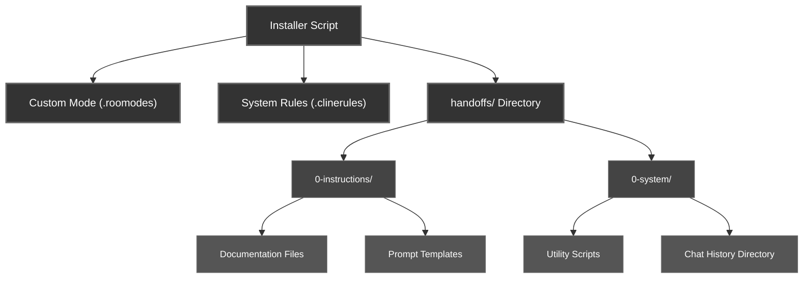
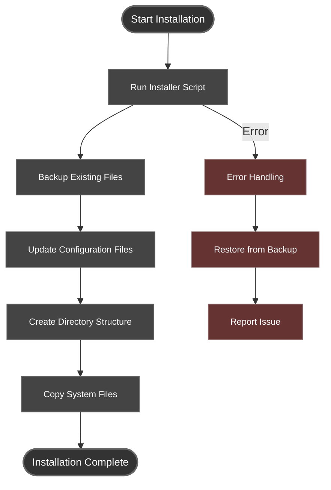

# Basic Installation Guide

## Overview

The Basic Installation provides the simplest way to implement the Handoff System using the automated installer script. This approach requires minimal setup and automatically handles all configuration details.

## Prerequisites

Before installation, ensure you have:

- **Node.js**: The installer requires Node.js to be installed (any recent version)
- **Project Directory**: A project directory where you want to add handoff management capabilities
- **Write Access**: Permission to write files in your project directory

## Installation Steps

### 1. Download the Installer

Save the `handoff-manager-installer.js` file to your project's root directory.

### 2. Run the Installer

Run the installer from the command line in your project's root directory:

```bash
node handoff-manager-installer.js
```

> **IMPORTANT**: The installer MUST be run from your project's root directory where your .roomodes and .clinerules files are located. The Handoff Manager is designed to work alongside your existing Roo configuration.

### 3. Installation to a Different Directory

If you need to install to a specific project directory:

```bash
node handoff-manager-installer.js <project-root-directory>
```

#### Examples

Install to a specific project root:
```bash
node handoff-manager-installer.js ../my-project
```

Install to a parent project:
```bash
node handoff-manager-installer.js ..
```

## What Gets Installed

The installer creates the following components:



The installer adds these components to your project:
(Existing files are backed up and the script attempts to merge them, with about a 90% success rate :D )

- **Custom Mode Configuration**: Adds the "Handoff Manager" mode to your `.roomodes` file
- **System Rules**: Adds handoff system rules to your `.clinerules` file
- **Directory Structure**: Creates the following structure:
  - `handoffs/0-instructions/` - Documentation for the handoff system
  - `handoffs/0-instructions/prompts/` - Templates for common operations
  - `handoffs/0-system/scripts/` - Utility scripts for handoff management
  - `handoffs/0-system/chat-history/` - Directory for conversation exports

## Handoff Manager Custom Mode

The installer adds a dedicated "Handoff Manager" custom mode to your Roo environment, which:

- Provides specialized capabilities for managing project handoffs and milestones
- Has permission to create and edit files in the handoffs directory
- Follows structured workflows for creating handoffs, milestones, and restoring sessions
- Can access conversation history to enhance handoff content
- Uses a comprehensive system prompt with diagrams and structured processes

## Key Features

- **Existing Installation Detection**: Automatically detects and backs up any existing handoff system files
- **Configuration Merging**: Preserves your existing custom modes when adding handoff-manager mode
- **Complete System**: Contains all necessary files to get started immediately
- **Self-contained**: No external dependencies required
- **Intelligent Directory Detection**: Finds appropriate locations for files
- **Robust Error Handling**: Recovers gracefully from issues during installation
- **Flexible Conversation Extraction**: Works with conversation exports in various formats

## After Installation

Once installed, you can:

1. Switch to handoff-manager mode in Roo-Code
2. Create your first handoff with:
   ```
   I need to create a handoff document for our current work. Please follow the handoff creation workflow.
   ```
3. Create a handoff with conversation extraction:
   ```
   I need to create a handoff document incorporating insights from our conversation.
   ```
   - You can export your conversation to any file and place it in the `handoffs/0-system/chat-history/` directory
   - The handoff system will automatically find and process the file
4. Delete the handoff-manager-installer.js file after successful installation
   > This file is quite large and may overflow the context if accidentally read by an LLM.

## Installation Workflow



## Troubleshooting

- **File Permission Issues**: If you encounter permission errors, ensure you have write access to the target directory
- **Existing Files**: The installer will safely back up existing files, but check the backup directory if you need to recover previous versions
- **Installation Location**: If the installer can't find your project's configuration files, verify you're running it from the correct directory

## Next Steps

After installation, refer to the documentation in `handoffs/0-instructions/` for detailed information about:

1. Creating handoff documents
2. Creating milestone documents
3. Using conversation extraction
4. Restoring sessions from previous handoffs or milestones

For a more customized setup with manual control over each aspect of the system, see the [Advanced Installation Guide](advanced-installation.md).