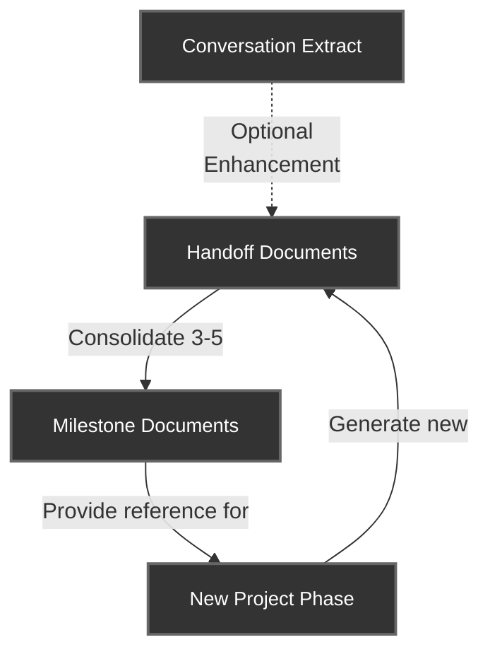
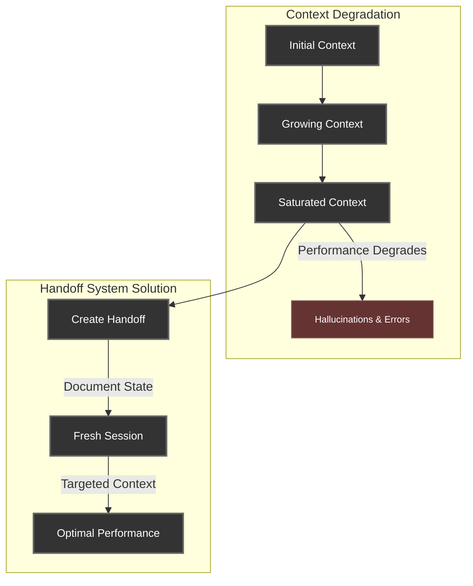
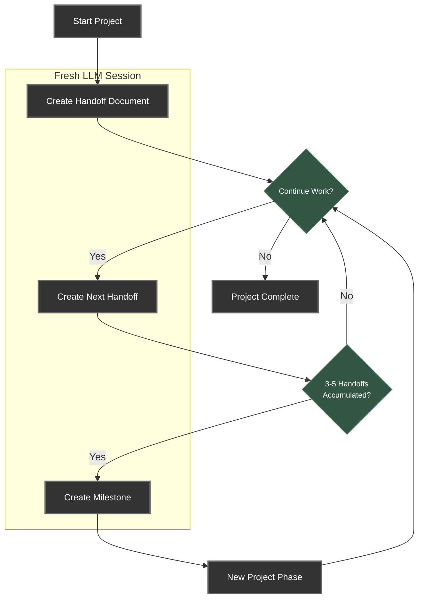
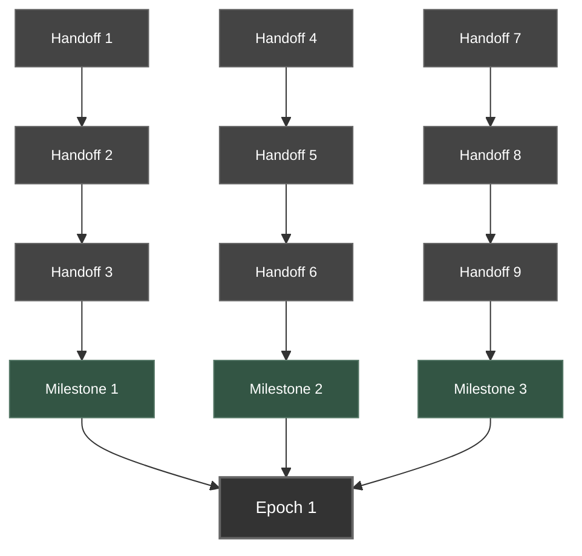

# The Handoff System

## Overview

The Handoff System is a structured knowledge management approach designed to optimize LLM performance across extended development sessions. By creating a seamless transition mechanism between LLM sessions, this system solves the fundamental problem of context window degradation while creating project development timeline documentation as a natural side effect.

**Implementation Options:**
- [Basic Installation](basic-installation.md) - Simple implementation using the automated installer script
- [Advanced Installation](advanced-installation.md) - Manual implementation for customized setups

## The Challenge

As LLMs work on projects, they encounter several limitations:

1. **Context Window Saturation**: LLMs accumulate context that becomes increasingly bloated with irrelevant information
2. **Performance Degradation**: Extended sessions lead to reduced reasoning quality and increased hallucinations
3. **Token Consumption**: Larger contexts consume more tokens and increase costs
4. **Knowledge Continuity**: Starting fresh loses critical project understanding

The Handoff System takes a chronological documentation approach. By creating discrete, sequential handoff documents and milestone summaries, it provides four main benefits:

- **Reduced Token Usage**: It creates write-once documents rather than requiring regeneration of entire context files
- **Preserved Development Insights**: It maintains lessons learned in their original, detailed form
- **Selective Context Loading**: It enables loading only the most relevant context based on current needs
- **Fresh Session Optimization**: It allows for rapidly spinning up fresh LLM sessions with precisely targeted context

Rather than actively condensing information, the system preserves everything but allows users to control which parts are loaded into context - effectively letting older information remain available but not consume tokens unless specifically needed.

## System Architecture

The Handoff System consists of two primary document types operating in a continuous cycle:

### 1. Handoff Documents

Sequential, numbered reports capturing development progress, stored in the project's `handoffs/` directory.

**Key characteristics:**
- Capture specific work completed in a session
- Document discoveries, problems, and solutions
- Flag work-in-progress items and priorities
- Provide chronological project history
- Can be enhanced with conversation extraction

*For details on handoff document format and structure, see the documentation in `handoffs/0-instructions/` after installation.*

### 2. Milestone Documents

Consolidated knowledge from multiple handoffs, created when significant project phases complete.

**Key characteristics:**
- Distill essential information from multiple handoffs
- Provide high-level project progress summaries
- Document lessons learned and best practices
- Store reusable patterns and solutions

## Workflow Visualization

The system operates as a continuous cycle:

## Getting Started

Choose the appropriate implementation guide based on your needs:

### [Basic Installation](basic-installation.md)
A simplified implementation that uses the automated installer script:
- One-step installation process
- Preserves existing project configurations
- Includes all necessary files and setup

### [Advanced Installation](advanced-installation.md)
A manual implementation approach for those who want more control:
- Step-by-step manual file copying
- Custom configuration options
- More granular control over the installation

## Benefits

The Handoff System provides multiple advantages:

1. **Performance Optimization**: Maintain peak LLM reasoning by starting fresh when needed
2. **Cost Efficiency**: Reduce token consumption by eliminating redundant context
3. **Focused Development**: Keep attention on what matters most with clean context
4. **Debugging Breakthrough**: Break stubborn problems with "fresh eyes" perspective
5. **Automatic Documentation**: Generate project history as a natural side-effect
6. **Knowledge Preservation**: Retain critical insights between sessions
7. **Project Continuity**: Seamlessly transition between development phases

## Practical Applications

The system excels in scenarios like:

- **Complex, Long-Running Projects**: Maintain clarity across weeks of development
- **Team Collaboration**: Allow multiple developers to build on each other's work
- **Challenging Debug Sessions**: Break through stubborn issues with fresh perspective
- **Project Resumption**: Return to projects after extended breaks with minimal context loss
- **Token Optimization**: Reduce costs on projects with extensive context requirements

## Best Practices

To get the most out of the Handoff System, follow these proven practices:

- **Create Handoff Before Milestone**: Always create a final handoff document before creating a milestone
- **Use Sequential Numbering**: Keep handoff and milestone numbering sequential to maintain chronological clarity
- **Regular Small Handoffs**: Create smaller, more frequent handoffs rather than infrequent large ones
- **Milestone at Natural Boundaries**: Create milestones at the completion of logical project phases or features
- **Use Conversation Extraction**: Enhance handoffs with insights from conversation history when available

## Future Enhancements

The Handoff System has been designed with extensibility in mind. As development needs grow and projects become more complex, the architecture can naturally evolve to accommodate larger scales and longer timeframes.

### Epochs: A Third Tier for Complex Projects

For exceptionally complex projects, introducing "Epochs" as a third tier could further enhance the system's scalability. Epochs would represent major project eras - perhaps spanning multiple feature sets, version releases, or architectural paradigms.

The hierarchical structure would then flow naturally:
- **Handoffs**: Capture day-to-day progress and specific problem-solving details
- **Milestones**: Consolidate 3-5 handoffs into feature or phase summaries
- **Epochs**: Aggregate multiple milestones into major project chapters