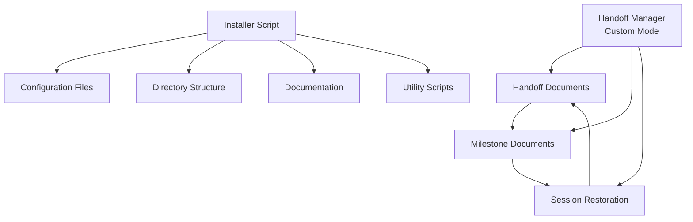

# Handoff System Documentation

## Introduction

Welcome to the Handoff System documentation. This suite of documents provides comprehensive information about the Handoff System, its installation, usage, and technical details.

## Table of Contents

| Document | Description |
|----------|-------------|
| [Handoff System Overview](handoff-system.md) | Core concepts, benefits, and architecture of the Handoff System |
| [Basic Installation Guide](basic-installation.md) | Step-by-step guide for automated installation using the installer script |
| [Advanced Installation Guide](advanced-installation.md) | Manual installation process with customization options |
| [Usage Guide](usage-guide.md) | Instructions for using the Handoff Manager after installation |

## Quick Start

For most users, the quickest way to get started is:

1. Read the [Handoff System Overview](handoff-system.md) to understand the concepts
2. Follow the [Basic Installation Guide](basic-installation.md) to install the system
3. Refer to the [Usage Guide](usage-guide.md) to begin creating handoffs and milestones

## System Architecture

The Handoff System consists of these core components:

## Developer Paths

Depending on your needs, you may follow different paths through this documentation:

### End User Path
- Handoff System Overview → Basic Installation → Usage Guide

### Custom Integration Path
- Handoff System Overview → Advanced Installation → Usage Guide

## Additional Resources

For related topics, refer to:

- Custom Modes Documentation (in your project's documentation)
- Roo-Code Context Management Documentation
- Node.js Documentation (for script execution)
- Publisher System Documentation (in handoff-publisher/docs directory)