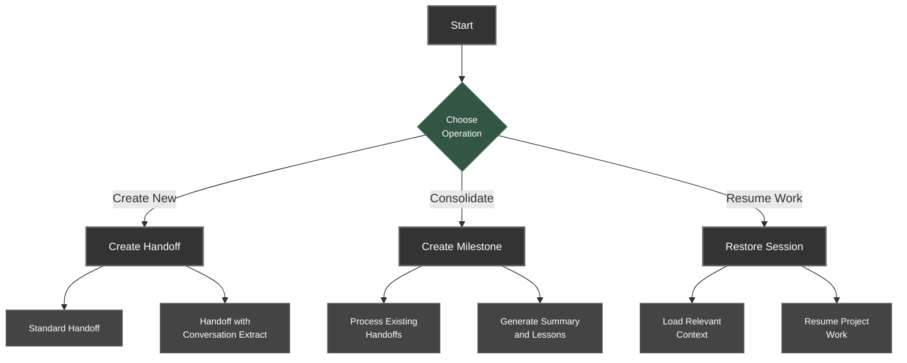
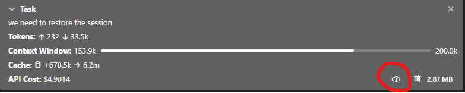

# Handoff System Usage Guide

## Overview

This guide explains how to use the Handoff Manager after installation. The Handoff Manager provides a structured approach to maintaining context between development sessions through handoff documents and milestones.

## Getting Started

After installation (either via the [basic](basic-installation.md) or [advanced](advanced-installation.md) method), you'll have access to the Handoff Manager custom mode in Roo-Code.

### Switching to Handoff Manager Mode

To use the Handoff System, first switch to the handoff-manager mode in Roo-Code:

```
Switch to handoff-manager mode
```

## Core Operations

The Handoff Manager supports these primary operations:



### 1. Creating Handoff Documents

A handoff document captures the current state of your project for future reference.

#### Standard Handoff Creation

To create a standard handoff document:

```
I need to create a handoff document for our current work. Please follow the handoff creation workflow.
```

The Handoff Manager will:
1. Examine the handoffs directory to determine the next handoff number
2. Create a properly structured handoff document
3. Include relevant information from the current session

#### Enhanced Handoff with Conversation Extraction

If you want to include insights from your conversation history:

1. Export your conversation from Roo-Code by clicking the cloud download icon in the task modal:

   

   Click the cloud download icon (highlighted above) to download your conversation history.

2. Save the downloaded file (any filename is fine)

3. Either:
   - Place the exported conversation file in the `handoffs/0-system/chat-history/` directory, or
   - Provide a direct path to the file when requesting a handoff

4. Use this prompt:
   ```
   I need to create a handoff document incorporating insights from our conversation.
   ```

The Handoff Manager will:
1. Find the conversation file (either in the chat-history directory or at the specified path)
2. Execute the appropriate extraction script
3. Analyze the conversation for key insights
4. Create an enhanced handoff that includes these insights

### 2. Creating Milestone Documents

When you've accumulated 3-5 handoffs or completed a significant project phase, create a milestone:

```
I need to create a milestone document for our completed work. Please follow the milestone creation workflow.
```

The Handoff Manager will:
1. Check if you have handoff documents in the root directory
2. Calculate the next milestone number
3. Create a milestone directory
4. Move relevant handoff files into the milestone directory
5. Generate two key documents:
   - `0-milestone-summary.md`: High-level overview of achievements
   - `0-lessons-learned.md`: Reusable patterns and solutions

### 3. Restoring Sessions

When returning to a project after a break, use the session restoration feature:

```
I need to restore context from our previous work. Please follow the session restoration workflow.
```

The Handoff Manager will:
1. Examine the handoffs directory structure
2. Identify the most relevant documents to load
3. Read milestone summaries and recent handoffs
4. Provide a comprehensive understanding of the project's current state

## Handoff Document Structure

Handoff documents follow this structure:

```markdown
# [TOPIC] Handoff - [DATE]

## Summary
[2-3 sentence overview]

## Priority Development Requirements (PDR)
- **HIGH**: [Must address immediately]
- **MEDIUM**: [Address soon]
- **LOW**: [Be aware]

## Discoveries
- [Unexpected finding 1]
- [Unexpected finding 2]

## Problems & Solutions
- **Problem**: [Issue description]
  **Solution**: [Solution applied]
  ```code example if needed```

## Work in Progress
- [Task 1]: [Progress %]
- [Task 2]: [Progress %]

## Deviations
- [Changed X to Y because Z]

## References
- [doc/path1]
- [doc/path2]
```

## Milestone Document Structure

Milestone directories contain these key files:

### 1. 0-milestone-summary.md

```markdown
# [Project/Feature] Milestone Summary - [DATE]

## Changes Implemented
- [Major change 1]
- [Major change 2]
- [Major change 3]

## Key Decisions
- [Decision 1]: [Rationale]
- [Decision 2]: [Rationale]
- [Decision 3]: [Rationale]

## Discoveries
- [Important finding 1]
- [Important finding 2]
- [Important finding 3]

## Current System State
- [Component 1]: [Status]
- [Component 2]: [Status]
- [Component 3]: [Status]
```

### 2. 0-lessons-learned.md

```markdown
# Lessons Learned - [Feature/Component]

## [Problem Category 1]

**Problem:** [Issue description]

**Solution:**
- [Solution step 1]
- [Solution step 2]
- [Solution step 3]

## [Problem Category 2]

**Problem:** [Issue description]

**Solution:**
- [Implementation details]
- [Code patterns to use]
- [Testing approach]

## Tools and Libraries

- [Tool/Library 1]: [Usage and value]
- [Tool/Library 2]: [Usage and value]

## Edge Cases

- [Edge case 1]: [Handling approach]
- [Edge case 2]: [Handling approach]
```

## Working with Conversation Extraction

The conversation extraction feature enhances handoffs with insights from your conversation history:

### Exporting Your Conversation

1. **Find the Task Modal**: 
   - Look for the task modal in the top-right corner of your Roo-Code interface
   - It shows information about your current session including tokens, context window, and cache

2. **Locate and Click the Download Button**:
   
   - Click the cloud download button (highlighted above) to download your conversation history
   - The file size is displayed next to the button (e.g., 2.87 MB)

3. **Save the Conversation File**:
   - Choose a location on your computer to save the file
   - You can use any filename you prefer
   - The file will be saved in Markdown format

### Using the Exported Conversation

Once you have exported your conversation, you have two options:

1. **Automatic Detection**:
   - Place the exported file in the `handoffs/0-system/chat-history/` directory
   - The Handoff Manager will automatically find and use this file

2. **Manual Specification**:
   - Keep the file anywhere on your system
   - When running the extraction script manually, provide the file path:
     ```
     node handoffs/0-system/scripts/1-extract-conversation.js /path/to/your/conversation-file.md
     ```

3. **Create Enhanced Handoff**:
   - Simply request a handoff with conversation extraction:
     ```
     I need to create a handoff document incorporating insights from our conversation.
     ```
   - The Handoff Manager will automatically find the conversation file and process it

## Best Practices

### When to Create Handoffs

Create handoff documents when:
- Context becomes ~30% irrelevant to current task
- After completing significant project segments
- After 10+ conversation exchanges
- During debugging sessions exceeding 5 exchanges without resolution

### When to Create Milestones

Create milestone documents when:
- Completing major features or components
- After 3-5 handoffs accumulate
- A significant project phase concludes
- Critical bug is fixed
- Implementation approach has changed

### Document Quality Guidelines

For effective knowledge transfer:

1. **Be Specific**: Include concrete details and measurable outcomes
2. **Focus on Changes**: Emphasize what's different now vs. before
3. **Highlight Roadblocks**: Document issues encountered and their solutions
4. **Track Progress**: Note completion percentages for in-progress items
5. **Reference Related Files**: Link to relevant code or documentation

## Advanced Usage Tips

### Custom Naming for Handoffs

For more targeted handoffs:

```
I need to create a handoff document focused on [SPECIFIC TOPIC]. Please include these key points:
- [KEY POINT 1]
- [KEY POINT 2]
- [KEY POINT 3]
```

### Milestone Organization Scripts

For organizing handoff files when creating milestones, the system provides automation scripts:

- JavaScript: `handoffs/0-system/scripts/2-create-milestone.js`
- Python: `handoffs/0-system/scripts/2-create-milestone.py`

These scripts create the milestone directory and move relevant handoff files.

### Directory Structure Management

Keep your handoffs directory organized:
- Handoff documents in root directory: `handoffs/1-setup.md`
- Milestone directories: `handoffs/1-core-entities/`
- System files in 0-prefixed directories: `handoffs/0-instructions/`
- Conversation exports in: `handoffs/0-system/chat-history/`

## Troubleshooting

### Conversation Extraction Issues

If extraction scripts fail:
1. Check that you have Python or Node.js installed
2. Verify the conversation file exists and is properly formatted
3. Check script permissions
4. Try the alternative script (Python or JavaScript)
5. Make sure the file is in the expected location, or provide a full path to the file

### Directory Structure Problems

If the Handoff Manager can't find expected directories:
1. Verify the handoffs directory exists at the project root
2. Check if the 0-instructions and 0-system directories exist
3. Ensure you are in handoff-manager mode
4. Verify file permissions allow creation and modification

### Custom Mode Issues

If the handoff-manager mode isn't working correctly:
1. Check that the .roomodes file contains the handoff-manager mode
2. Verify the file pattern regex is correct
3. Restart Roo-Code to load the updated configuration