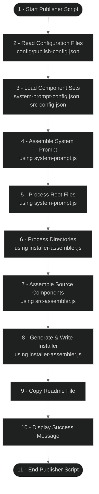

# Handoff Publisher Workflow

This flowchart represents the high-level operational flow of the modular handoff publisher package. The package:

1. Reads configuration from the config directory
2. Loads component set configurations (system-prompt and source-code)
3. Assembles the system prompt using the system-prompt module
4. Processes root files using the system-prompt module
5. Processes directories using the installer-assembler module
6. Assembles source code components using the src-assembler module
7. Generates a self-contained installer using the installer-assembler module
8. Copies the readme file to the output directory
9. Displays a success message

The modular architecture improves maintainability by separating concerns into distinct components:
- `file-utils.js`: File operation utilities
- `config-merger.js`: Handles merging of configuration files
- `system-prompt.js`: Assembles the system prompt
- `src-assembler.js`: Assembles source code components
- `installer-assembler.js`: Generates the installer script
- `index.js`: Main entry point

The component-based design allows for easy extension through standardized component sets defined in publish-config.json. See [Component Sets Specification](component-sets-specification.md) for details on creating additional component sets.