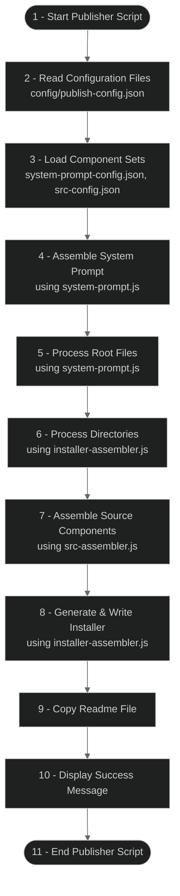

# Handoff Publisher System

## Overview

The Handoff Publisher System is a specialized toolkit for generating the self-contained installer script used in the basic installation approach. It uses a modular, component-based architecture to assemble the installer from individual parts, making maintenance and updates straightforward.



## Purpose

The Publisher System serves several key purposes:

1. **Maintainable Architecture**: Breaks down the complex installer into manageable components
2. **Reproducible Builds**: Ensures consistent installer generation with each update
3. **Separation of Concerns**: Isolates system prompt content from code logic
4. **Version Control**: Makes tracking changes to specific components easier
5. **Extensibility**: Allows for adding new functionality through the component system

## Key Components

The publisher consists of these core elements:

### 1. Component Sets

The system is built around standardized component sets:

- **System Prompt Components**: Markdown files defining the system prompt for the Handoff Manager
  - Location: `1-handoff-custom-mode/components/`
  - Files: Numbered Markdown files defining aspects of the system (e.g., `1-header.md`, `2-virtual-tools.md`)
  - Config: `system-prompt-config.json`

- **Source Code Components**: JavaScript modules providing the installer's functionality
  - Location: `handoff-publisher/lib/src/`
  - Files: Numbered JavaScript files with specific functions (e.g., `1-utils.js`, `2-backup.js`)
  - Config: `src-config.json`

### 2. Core Modules

The publisher is built with modular components:

| Module | Purpose |
|--------|---------|
| `file-utils.js` | File operation utilities |
| `config-merger.js` | Handles merging of configuration files |
| `system-prompt.js` | Assembles the system prompt |
| `src-assembler.js` | Assembles source code components |
| `installer-assembler.js` | Generates the installer script |
| `index.js` | Main entry point |

### 3. Configuration

The publisher uses a configuration-driven approach:

- **publish-config.json**: Main configuration file defining:
  - Output path for the installer
  - Component sets to include
  - File paths and patterns
  - Version information

## How It Works

### Component Assembly Process

The publisher follows this process to generate the installer:

1. **Configuration Loading**: Reads the main configuration file
2. **Component Discovery**: Scans the specified directories for components
3. **System Prompt Assembly**: Combines Markdown components into a single system prompt
4. **Source Code Assembly**: Assembles JavaScript components into installer code
5. **Installer Generation**: Creates a single, self-contained installer script
6. **Verification**: Validates the generated installer
7. **Documentation**: Copies the installer readme file

### Component Naming Convention

Components follow a numbered naming convention to ensure proper loading order:

- System prompt components: `1-header.md`, `2-virtual-tools.md`, etc.
- Source code components: `1-utils.js`, `2-backup.js`, etc.

The numbering dictates both the loading order and the logical flow of dependencies.

## Using the Publisher

To generate a new installer:

1. Make any necessary changes to the component files
2. Update the configuration files if needed
3. Run the publisher script:

```bash
# From the handoff-system directory
node publish-handoff-manager.js
```

The publisher will:
1. Assemble the system prompt from components
2. Process all files specified in the configuration
3. Generate a standalone installer script
4. Copy the readme file to the output directory

The installer will be created at the path specified in `publish-config.json`.

## Extending the Publisher

### Adding New Component Sets

To create a new component set:

1. Create a dedicated directory for your components
2. Create numbered component files with clear names
3. Create a configuration file for the component set
4. Add the component set to the `componentSets` array in `publish-config.json`

### Component Configuration Structure

```json
{
  "components": [
    {
      "file": "1-component.js",
      "description": "Description of the component's functionality"
    },
    {
      "file": "2-component.js",
      "description": "Description of the component's functionality"
    }
  ],
  "version": "1.0.0",
  "errorHandling": {
    "missingFile": "error",
    "continueOnError": false
  }
}
```

### Adding to publish-config.json

```json
"componentSets": [
  {
    "type": "your-component-type",
    "sourcePath": "path/to/components",
    "configFile": "your-config.json"
  }
]
```

## Best Practices

1. **Keep Components Small**: Each component should have a single responsibility
2. **Meaningful Numbering**: Use numbering to indicate dependencies and loading order
3. **Include Descriptions**: Add detailed descriptions to your component configurations
4. **Test Incrementally**: Test changes to individual components before publishing
5. **Version Control**: Track component changes with clear commit messages
6. **Error Handling**: Configure appropriate error handling for each component set

## Troubleshooting

- **Missing Components**: If components are not being included, check the path in the configuration file
- **Assembly Errors**: Check the component loading order if there are dependency issues
- **Configuration Issues**: Validate JSON syntax in configuration files
- **Large Installer Size**: Consider optimizing large components or splitting functionality

## Future Enhancements

Potential improvements to the publisher system include:

- Automated testing of the generated installer
- Minification options for reducing installer size
- Pluggable component processors for specialized transformations
- Configuration validation schema
- Interactive mode for customizing the installer at generation time