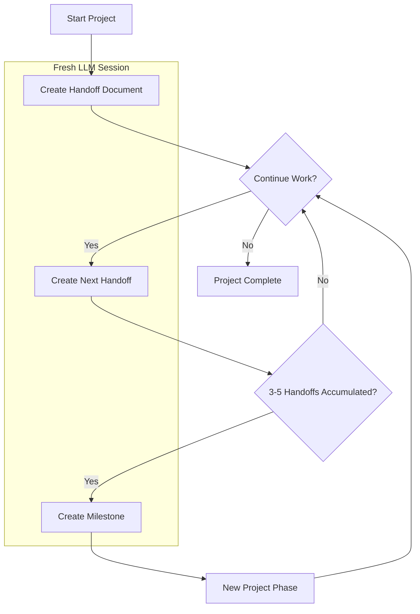

# The Handoff System

## Overview

The Handoff System is a structured knowledge management approach designed to optimize LLM performance across extended development sessions. By creating a seamless transition mechanism between LLM sessions, this system solves the fundamental problem of context window degradation while creating project development timeline documentation as a natural side effect.

## The Challenge

As LLMs work on projects, they encounter several limitations:

1. **Context Window Saturation**: LLMs accumulate context that becomes increasingly bloated with irrelevant information
2. **Performance Degradation**: Extended sessions lead to reduced reasoning quality and increased hallucinations
3. **Token Consumption**: Larger contexts consume more tokens and increase costs
4. **Knowledge Continuity**: Starting fresh loses critical project understanding

Developers typically address these LLM limitations through memory bank solutions, which maintain project context in continuously updated files. This approach provides a current snapshot of the project state and recent decisions, which is valuable for ongoing development. However, as projects evolve, these systems face certain limitations: they actively condense information into fixed files, deliberately summarizing or removing details to maintain manageable file sizes; they focus primarily on current state rather than preserving the full developmental journey; and they have no guard rails to help prevent the LLM from repeating the same mistakes over and over. This active summarization often results in lost nuance and context that could be valuable later.

The Handoff System takes a different approach through chronological documentation. By creating discrete, sequential handoff documents and milestone summaries, it provides four main benefits: 1) it reduces token usage by creating write-once documents rather than requiring regeneration of entire context files, 2) it preserves development insights and lessons learned in their original, detailed form, 3) it enables selective loading of only the most relevant context based on current needs, and 4) it allows for rapidly spinning up fresh LLM sessions with precisely targeted context. Rather than actively condensing information, the system preserves everything but allows users to control which parts are loaded into context - effectively letting older information remain available but not consume tokens unless specifically needed.

## System Architecture

The Handoff System consists of two primary document types operating in a continuous cycle:

### 1. Handoff Documents

Sequential, numbered reports capturing development progress, stored in the project's `handoffs/` directory.

**Key characteristics:**
- Capture specific work completed in a session
- Document discoveries, problems, and solutions
- Flag work-in-progress items and priorities
- Provide chronological project history

### 2. Milestone Documents

Consolidated knowledge from multiple handoffs, created when significant project phases complete.

**Key characteristics:**
- Distill essential information from multiple handoffs
- Provide high-level project progress summaries
- Document lessons learned and best practices
- Store reusable patterns and solutions

### Directory Structure

```
project/
├── handoffs/                   # Main handoff directory
│   ├── 0-instructions/         # System documentation (folders sort first)
│   │   ├── 0-intro.md
│   │   ├── 1-handoff-instructions.md
│   │   ├── 2-milestone-instructions.md
│   │   ├── 3-milestone-scripts.md
│   │   ├── H-handoff-prompt.md
│   │   └── M-milestone-prompt.md
│   │
│   ├── 1-feature-milestone/    # Milestone directory (numbered sequentially)
│   │   ├── 0-milestone-summary.md  # Consolidated milestone information
│   │   ├── 0-lessons-learned.md    # Key learnings
│   │   └── ...                 # Copies of related handoff documents
│   │
│   ├── 2-refactor-milestone/   # Next sequential milestone
│   │   ├── 0-milestone-summary.md
│   │   └── 0-lessons-learned.md
│   │
│   ├── 1-setup.md              # Sequential handoff documents
│   ├── 2-implementation.md     # Files are sorted after folders
│   ├── 3-bugfixes.md
│   ├── 4-feature-x.md
│   └── 5-refactoring.md
```

## Workflow Visualization

The system operates as a continuous cycle:



## Implementation Process

### When to Create Handoffs

Create handoff documents when:
- Completing a significant project segment
- Context becomes ~30% irrelevant to current task
- After 10+ conversation exchanges
- During debugging sessions exceeding 5 exchanges without resolution

### When to Create Milestones

Create milestone documents when:
- A major feature/component is fully implemented
- A significant project phase is completed
- 3-5 handoffs have accumulated
- Critical problems with valuable lessons have been solved
- The project reaches a stable/deployable state

### Knowledge Transfer Mechanism

When starting a new LLM session, use the prompt templates provided in the system:

- **For general continuation**: Use the `H-handoff-prompt.md` template to direct the LLM to read all handoff documents. This prompt ensures the LLM reads through the documents in the correct chronological order and reports back to verify understanding.

- **After milestone creation**: Use the `M-milestone-prompt.md` template to direct the LLM to read only the milestone summary documents (0-prefixed files in milestone directories).

These prompt templates serve as starting points that you can customize for your specific project needs. Consider modifying them to include:
- Project README files
- Documentation in docs/ directories
- API specifications
- Architecture diagrams
- Database schemas
- MCP server useage
- Other project-specific resources that provide important context

The key is to balance providing enough context for the LLM to be effective while avoiding unnecessary token consumption. The prompts have verification mechanisms built in to ensure the LLM properly processes the handoff/milestone documents.

## Benefits

The Handoff System provides multiple advantages:

1. **Performance Optimization**: Maintain peak LLM reasoning by starting fresh when needed
2. **Cost Efficiency**: Reduce token consumption by eliminating redundant context
3. **Focused Development**: Keep attention on what matters most with clean context
4. **Debugging Breakthrough**: Break stubborn problems with "fresh eyes" perspective
5. **Automatic Documentation**: Generate project history as a natural side-effect
6. **Knowledge Preservation**: Retain critical insights between sessions
7. **Project Continuity**: Seamlessly transition between development phases

## Practical Applications

The system excels in scenarios like:

- **Complex, Long-Running Projects**: Maintain clarity across weeks of development
- **Team Collaboration**: Allow multiple developers to build on each other's work
- **Challenging Debug Sessions**: Break through stubborn issues with fresh perspective
- **Project Resumption**: Return to projects after extended breaks with minimal context loss
- **Token Optimization**: Reduce costs on projects with extensive context requirements

## Inspiration

This system draws inspiration from knowledge transfer protocols used in intelligence analysis, where information continuity between shifts is essential. These practical handoff techniques have been adapted to address the specific challenges that arise during extended LLM development sessions.

## Getting Started

1. Create a `handoffs/` directory in your project
2. Copy the instruction templates from this repository
3. Begin documenting your development with handoff documents
4. Create milestone summaries at significant completion points
5. Use the provided prompts when switching to fresh LLM sessions

By implementing this lightweight yet powerful system, you'll maintain optimal LLM performance throughout your project's lifecycle while generating valuable documentation that enhances collaboration and knowledge retention.