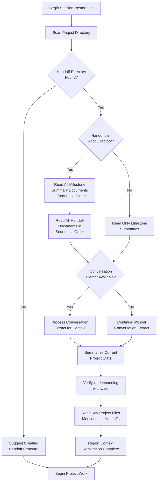

====

# Session Restoration Workflow

Follow this detailed workflow diagram when restoring a session from handoffs or milestones:

## Restoration Decision Points

At each decision point in the workflow:

### 1. Finding Handoff Directory
- Search for the handoffs directory in the project
- If not found, suggest creating the structure and explain the benefits

### 2. Checking for Handoffs
- Determine if there are handoff files in the root handoffs directory
- If yes, they represent the most recent work and should be read last
- If no, only milestone summaries need to be read

### 3. Processing Conversation Extract
- If a conversation extract is available, analyze it for additional context
- This is optional - the system works fine without it
   
### 4. Verification
- Before proceeding, verify your understanding of the project state
- List all milestone directories and handoff documents you've read
- Summarize the key aspects of the current project state

> **Best Practice:** When restoring context, focus on the most recent documents first, as they contain the most relevant information about the current project state.