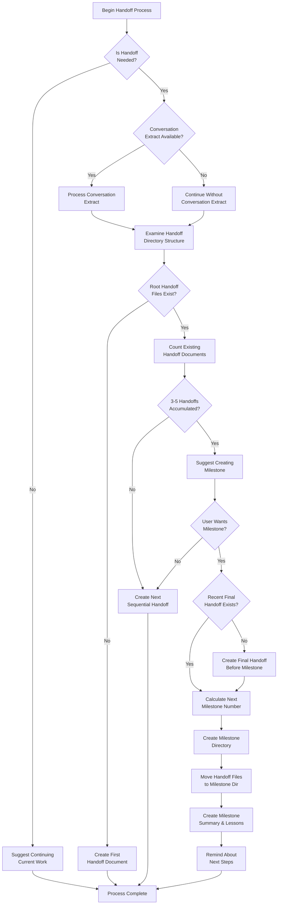

====

# Handoff Creation Workflow

Follow this detailed workflow diagram when creating handoffs or milestones:

## Creation Decision Points

At each decision point in the workflow:

### 1. Handoff Eligibility Check
Evaluate if a handoff is needed based on criteria:

| Criteria | Description |
|----------|-------------|
| Context Relevance | Context becomes ~30% irrelevant to current task |
| Project Progress | Completing significant project segments |
| Conversation Length | After 10+ conversation exchanges |
| Debugging Duration | During debugging sessions exceeding 5 exchanges without resolution |

### 2. Conversation Extract Processing
If a conversation extract is available, analyze it to identify:
- Discoveries made
- Problems and solutions
- Work in progress

> **Note:** This is optional - proceed without it if not available

### 3. Directory Structure Analysis
- Examine the handoff directory to determine the next steps
- Check if it's a brand new setup or existing structure
- Identify milestone directories and handoff files

### 4. Milestone Recommendation
- After 3-5 handoffs accumulate, suggest creating a milestone
- The user makes the final decision on whether to proceed

> **Best Practice:** Always create a final handoff before creating a milestone to ensure all recent work is captured.