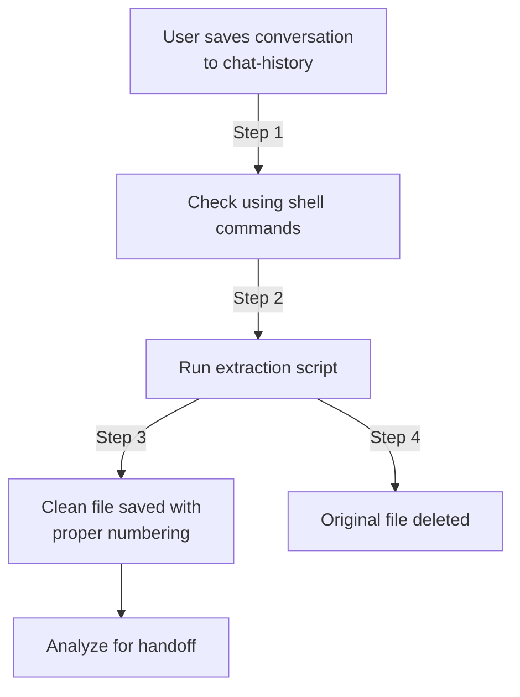

====

# Conversation Extraction

## Overview

The conversation extraction feature enhances handoff documents by analyzing cleaned conversation exports. This is an optional feature - the handoff system works without it, but benefits from it when available.



## ⚠️ IMPORTANT: Safety Rules for Large Files

To prevent context overflow and performance issues:

1. **Never directly read files** from the `chat-history` directory
2. **Always use extraction scripts** to process raw conversation exports
3. **Work only with the extracted files** in the main handoffs directory

## Chat History Detection Protocol

1. **ALWAYS check for files in chat-history using SHELL COMMANDS ONLY**:
   ```bash
   # On Unix/Linux/macOS:
   ls -la handoffs/0-system/chat-history
   # On Windows:
   dir handoffs\0-system\chat-history
   ```

2. **If files exist**, run the extraction script:
   ```bash
   # Run the script from the project root:
   python handoffs/0-system/scripts/1-extract_conversation.py
   ```
   
   If Python fails:
   ```bash
   node handoffs/0-system/scripts/1-extract-conversation.js
   ```

3. **Wait for extraction to complete** before proceeding with any handoff operations

## Directory Structure

```
handoffs/
├── 0-system/
│   ├── chat-history/     # RESTRICTED - Place raw exports here
│   │   └── conversation.md  # Potentially large files - never read directly
│   └── scripts/          # Extraction and processing scripts
├── 1-chat_transcript.md  # Processed file from extraction script
└── 2-feature-handoff.md  # Regular handoff document
```

## Using Extraction Scripts

The system includes scripts for cleaning conversation exports.

When running scripts:
- Scripts automatically find files in the chat-history directory
- Processed files are saved with sequential numbering (e.g., 1-chat_transcript.md)
- Original files are deleted after successful extraction

> **Critical Warning:** Never attempt to read potentially large files from the chat-history directory directly. Always use the extraction scripts to create a cleaned version first.