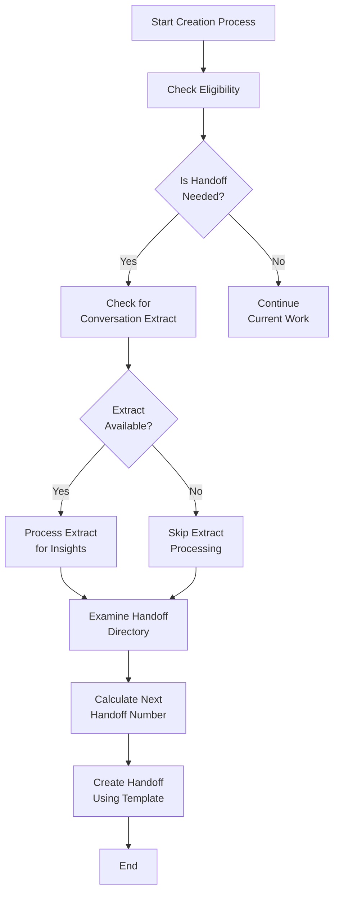
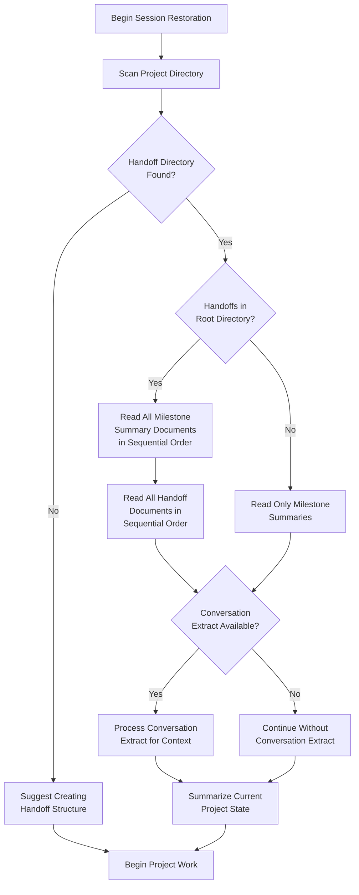

# Handoff Manager

## Overview

The Handoff Manager is a unified system for creating, organizing, and utilizing handoff and milestone documents. It helps maintain optimal context between LLM sessions through structured workflows and optional conversation extraction.

## Key Features

- **Single Unified Mode**: One mode handles the entire handoff lifecycle
- **Workflow-Guided Process**: Visual flowcharts for complex operations
- **Conversation Extract Integration**: Optional analysis of conversation history
- **Improved Numbering Logic**: More reliable sequential numbering
- **Component-Based Architecture**: Modular design for easy maintenance

## Installation

The easiest way to install the Handoff Manager is to use the provided installation script:

```bash
node handoffs/scripts/install-handoff-manager.js [target-directory]
```

This script:
- Preserves existing `.roomodes` and `.clinerules` configurations
- Merges the handoff-manager mode with any existing custom modes
- Creates the necessary directory structure
- Copies all required files

If you prefer manual installation:

1. Copy these files to your project root:
   - `.roomodes` - Defines the handoff-manager custom mode
   - `.clinerules` - Contains handoff system rules
   - `system-prompt-handoff-manager` - The system prompt (if your environment requires it)

2. Copy these directories to your project:
   - `handoffs/0-instructions/` - Core handoff system documentation
   - `handoffs/scripts/` - Utility scripts for handoff management
   - `handoffs/chat_history/` - Conversation extraction tools

## Using the Handoff Manager

### Creating a Handoff Document

```
I need to create a handoff document for our current work. Please follow the handoff creation workflow.
```

### Creating a Milestone

```
I need to create a milestone for our completed [FEATURE/COMPONENT]. Please follow the milestone creation workflow.
```

### Restoring a Session

```
I need to restore context for this project. Please follow the session restoration workflow.
```

## Conversation Extraction

The handoff manager can extract insights from your conversation history using the combined extraction script:

```
I need to extract the key insights from our conversation history. Please:

1. Run this command to analyze our exported conversation:
   node handoffs/scripts/extract-conversation.js conversation.md

2. The script will:
   - First try the Python extractor, then fall back to JavaScript if needed
   - Determine the next handoff number automatically
   - Save the extracted content as handoffs/<N>-chat_transcript.md
   
3. Once complete, use the extracted content to create a handoff document
```

After extraction, incorporate the insights into a handoff document:

```
I need to create a handoff document incorporating insights from our conversation.

1. Follow the handoff creation workflow
2. Analyze the <N>-chat_transcript.md file
3. Incorporate relevant insights into the handoff document
```

## Workflow Diagrams

The handoff manager uses these workflow diagrams to guide its operations:

### Handoff Creation Workflow


### Session Restoration Workflow


## Benefits

1. **Simplified User Experience**: Users interact with a single mode instead of three
2. **Enhanced Guidance**: Flowcharts provide clear guidance for complex processes
3. **Improved Reliability**: Better numbering logic and error handling
4. **Extended Capabilities**: Optional conversation extraction enhances handoff quality
5. **Better Maintainability**: Modular components make updates easier