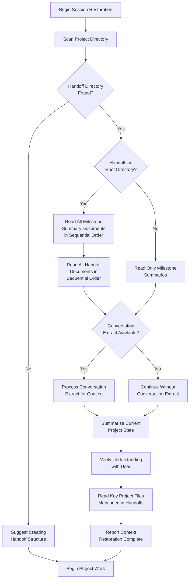
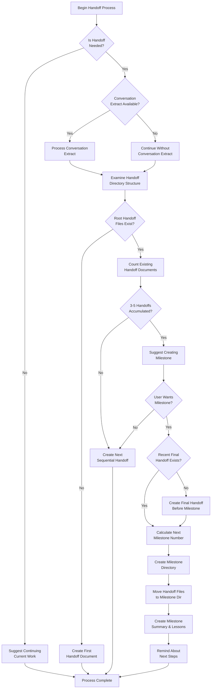

# Handoff System (Revised) - Component-Based Implementation

## Overview

The Handoff System is a structured knowledge management approach designed to optimize LLM performance across extended development sessions. This revised implementation uses a component-based architecture with a unified custom mode, similar to the roo-commander approach.

## Key Improvements

This revised implementation offers several advantages over the previous three-mode approach:

1. **Unified Interface**: A single `handoff-manager` mode handles the entire handoff lifecycle
2. **Flowchart-Guided Workflows**: Clear visual workflows guide the LLM through complex processes
3. **Conversation Extract Integration**: Optional analysis of conversation history enhances handoff quality
4. **Improved Numbering Logic**: More reliable sequential numbering of handoffs and milestones
5. **Component-Based Architecture**: Easier to maintain and extend with modular components

## Architecture

The system is built using a component-based approach:

```
handoff-system/
├── create-handoff-manager.js    # System generator script
├── system-prompt-handoff-manager # Assembled system prompt (generated)
├── .roomodes                    # Custom mode definition (generated)
├── .clinerules                  # System rules (generated)
├── .roo/                        # Component storage
│   └── components/              # System prompt components
│       ├── header.txt
│       ├── directory-detection.txt
│       ├── restoration-flowchart.txt
│       ├── creation-flowchart.txt
│       ├── handoff-creation.txt
│       ├── milestone-creation.txt
│       ├── session-restoration.txt
│       ├── conversation-extraction.txt
│       ├── numbering-logic.txt
│       └── safety-rules.txt
└── ... (standard handoff directories and files)
```

## Workflow Diagrams

The system includes two detailed workflow diagrams to guide the LLM through complex processes:

### Session Restoration Workflow



### Handoff Creation Workflow



## Conversation Extraction Integration

This system integrates with the conversation extraction tools in the `chat_history/` directory:

1. **Optional Enhancement**: Conversation extraction is an optional enhancement that improves handoff quality when available
2. **Pre-processing Approach**: Users export conversation history and process it before handoff creation
3. **Insight Extraction**: The system identifies key discoveries, problems, solutions, and work in progress from cleaned conversations
4. **Non-blocking**: The system functions fully without conversation extracts

## Setup Instructions

To set up the revised handoff system:

1. Run the generator script to create the component-based system:
   ```
   node create-handoff-manager.js
   ```

2. The script will:
   - Create the component directory structure
   - Generate the custom mode definition (.roomodes)
   - Assemble the system prompt from components
   - Create the .clinerules file

3. After setup, you can use the unified `handoff-manager` mode for all handoff tasks:
   - Creating handoff documents
   - Creating milestone summaries and organizing handoffs
   - Restoring context from existing handoffs and milestones

## Using the Unified Handoff Manager

The unified handoff manager provides a consistent interface for all handoff-related tasks:

### Creating a Handoff

```
I need to create a handoff document for our current work. Please follow the handoff creation workflow.
```

### Creating a Milestone

```
I need to create a milestone for our completed [FEATURE/COMPONENT]. Please follow the milestone creation workflow.
```

### Restoring a Session

```
I need to restore context for this project. Please follow the session restoration workflow.
```

### Using Conversation Extracts

To enhance handoff quality with conversation extraction:

1. Export your conversation history from Roo-Code
2. Run one of the extraction scripts:
   ```
   python chat_history/extract_conversation.py conversation.md extracted_conversation.md
   ```
   or
   ```
   node chat_history/extract_conversation.js conversation.md extracted_conversation.md
   ```
3. Make the extracted file available for the handoff manager to analyze

## Benefits Compared to Previous Approach

The revised component-based approach offers several advantages:

1. **Simplified User Experience**: Users interact with a single mode rather than switching between three
2. **Enhanced Guidance**: Flowcharts provide clear, visual guidance for complex processes
3. **Improved Reliability**: Component-based approach with explicit numbering logic reduces errors
4. **Extended Capabilities**: Integration with conversation extraction tools enhances handoff quality
5. **Future Extensibility**: Modular components make it easier to enhance or modify in the future