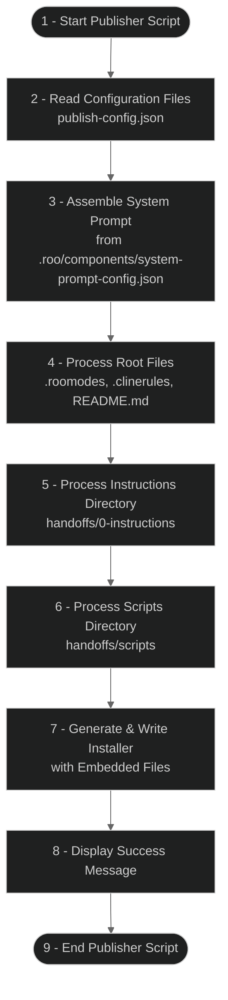

# Handoff System Publisher Script Workflow

This flowchart represents the high-level operational flow of the publisher script. The script reads configuration, assembles the system prompt according to the component config, processes required files in specific categories, and generates a self-contained installer.