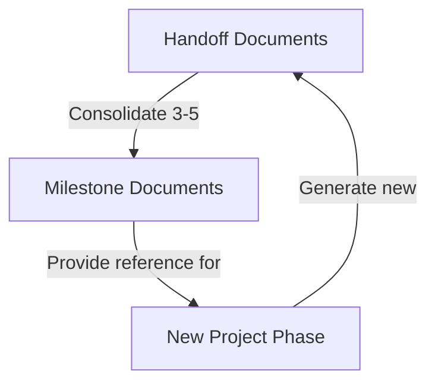

# The Handoff System - Basic Guide

## Overview

The Handoff System is a structured knowledge management approach designed to optimize LLM performance across extended development sessions. By creating a seamless transition mechanism between LLM sessions, this system solves the fundamental problem of context window degradation while creating project documentation as a natural side effect.

## How It Works

1. **Create Handoff Documents**: When context becomes cluttered or you complete significant work
2. **Accumulate 3-5 Handoffs**: Continue working until you have several related handoffs
3. **Create Milestones**: Consolidate handoffs into milestone summaries
4. **Start Fresh Sessions**: Use milestone summaries to inform new LLM sessions



## Setup Guide (One-Time)

### 1. Create the Directory Structure

```bash
# Create the handoffs directory and its instruction subdirectory
mkdir -p handoffs/0-instructions
```

### 2. Copy the Core Instruction Files

Copy these essential files from `RooCode-Tips-Tricks/handoffs/0-instructions/` to your project's `handoffs/0-instructions/` directory:

- `0-intro.md` - Overview of the system
- `1-handoff-instructions.md` - Format guidance for handoffs
- `2-milestone-instructions.md` - Format guidance for milestones
- `prompts/RH-resume-handoff.md` - Template for resuming from handoffs
- `prompts/RM-resume-milestone.md` - Template for resuming from milestones
- `prompts/CH-create-handoff.md` - Template for creating handoff documents
- `prompts/CM-create-milestone.md` - Template for creating milestone documents

### Directory Structure

```
project/
├── handoffs/                   # Main handoff directory
│   ├── 0-instructions/         # System documentation
│   │   ├── 0-intro.md
│   │   ├── 1-handoff-instructions.md
│   │   ├── 2-milestone-instructions.md
│   │   ├── prompts/            # Prompt templates
│   │   │   ├── RH-resume-handoff.md
│   │   │   ├── RM-resume-milestone.md
│   │   │   ├── CH-create-handoff.md
│   │   │   └── CM-create-milestone.md
│   │
│   ├── 1-feature-milestone/    # Milestone directory 
│   │   ├── 0-milestone-summary.md  # Consolidated information
│   │   ├── 0-lessons-learned.md    # Key learnings
│   │   └── ...                 # Copies of related handoffs
│   │
│   ├── 1-setup.md              # Sequential handoff documents
│   ├── 2-implementation.md     
│   └── 3-bugfixes.md
```

## Daily Usage

### When to Create Handoffs

Create handoff documents when:
- Completing a significant project segment
- Context becomes ~30% irrelevant to current task
- After 10+ conversation exchanges
- During debugging sessions exceeding 5 exchanges without resolution

### Creating a Handoff Document

When you need to create a handoff document, you have two options:

1. **Using the template prompt file** (recommended):
   - Copy and paste the content from `handoffs/0-instructions/prompts/CH-create-handoff.md`
   - The LLM will follow the instructions in this prompt template

2. **Using a simple prompt**:
   ```
   I need to create a handoff document for our current work. Please:

   1. Read the handoffs/0-instructions/1-handoff-instructions.md
   2. Determine the next sequential handoff number by examining the existing handoff files in the handoffs/ directory
   3. Create a properly structured handoff file with that number
   ```

### Creating a Milestone

After accumulating 3-5 handoffs or completing a significant project phase:

1. **Using the template prompt file** (recommended):
   - Copy and paste the content from `handoffs/0-instructions/prompts/CM-create-milestone.md`
   - The LLM will follow the instructions in this template for creating milestone documents

2. **Using a simple prompt**:
   ```
   I need to create a milestone for our completed [FEATURE/COMPONENT]. Please:
   
   1. First, check if there are recent handoff documents in the handoffs/ root directory:
      - If no handoffs exist, suggest creating a handoff first before proceeding
      - If handoffs exist but appear outdated, suggest creating a final handoff to capture latest work
   
   2. Read the handoffs/0-instructions/2-milestone-instructions.md
   3. Determine the next sequential milestone number by examining existing milestone directories
   4. Create the milestone directory with that number
   5. Move all numbered handoff documents from the handoffs/ root into this milestone directory
   6. Create the required 0-milestone-summary.md and 0-lessons-learned.md files
   ```

### Starting a New LLM Session

When starting a new LLM session after creating handoffs or milestones:

1. For detailed context, paste the content from `handoffs/0-instructions/prompts/RH-resume-handoff.md`
2. For condensed context after creating milestones, paste the content from `handoffs/0-instructions/prompts/RM-resume-milestone.md`


## Tips for Success

- **Handoff Before Milestone**: Always create a final handoff to capture your latest work before creating a milestone
- **Start Small**: Create your first handoff after setting up a project
- **Be Consistent**: Create handoffs regularly, not just when problems arise
- **Trust the Process**: The documentation created will become invaluable
- **Fresh Perspective**: A "clean slate" often solves stubborn problems
- **Review Periodically**: Look back at milestone summaries to track progress

## Next Steps

For an advanced implementation with custom modes that enhance the handoff creation process, see [The Handoff System - Advanced Guide](handoff-system-advanced.md).