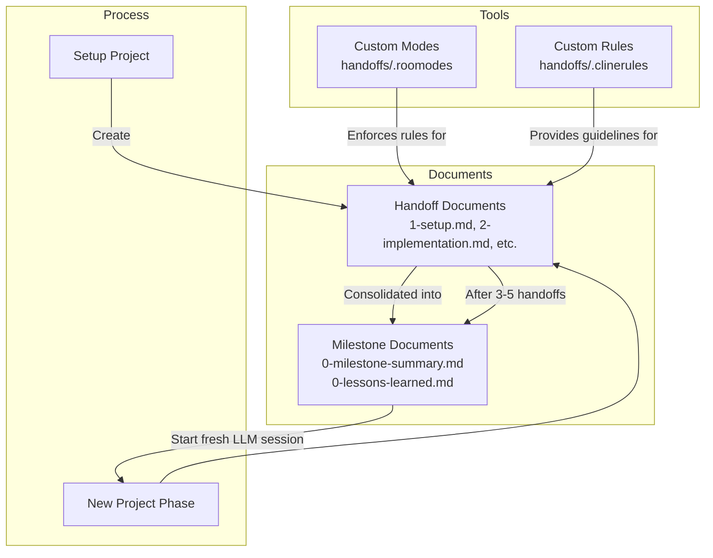
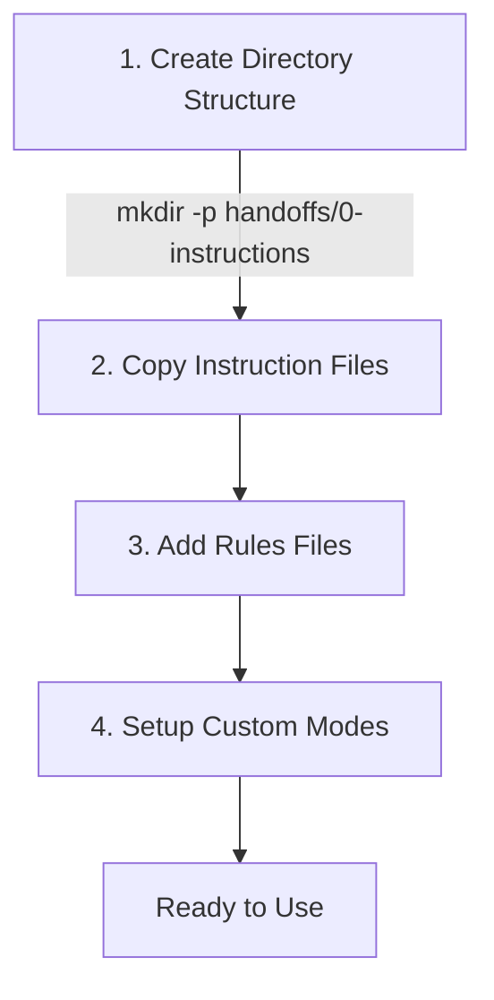
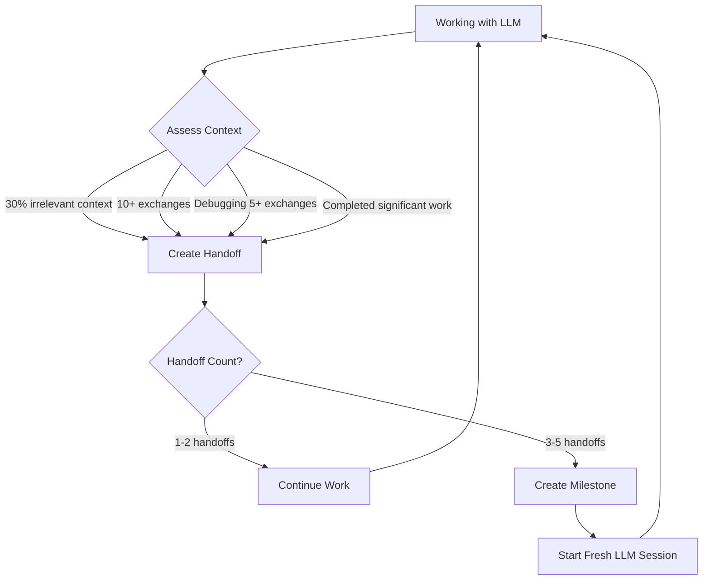
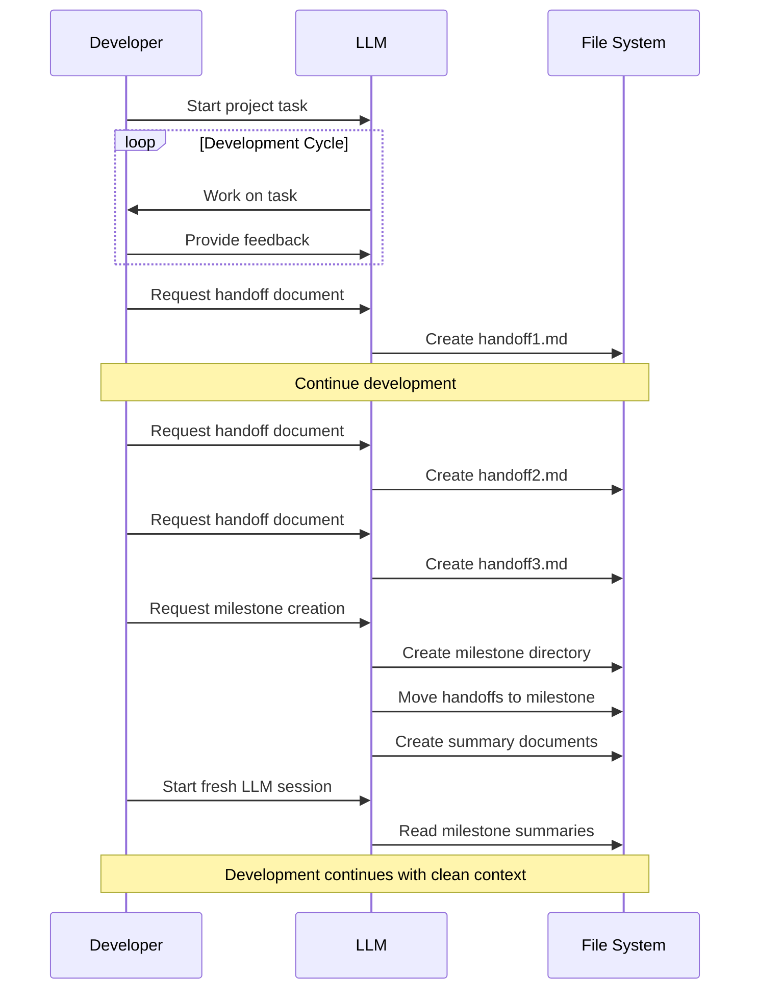

# Handoff System - Quick Start Guide

## What is the Handoff System?

The Handoff System is a simple yet powerful way to maintain optimal LLM performance during extended projects while automatically creating valuable documentation. It solves the problem of context window degradation by creating a structured system for switching to fresh LLM sessions when needed.

Think of it as "shift handovers" for your LLM: when one session gets overloaded or completes a phase, you document its work and start fresh with a clean context.

*For a deeper understanding of the concepts and architecture, see the [comprehensive handoff system documentation](handoff-system.md).*

## System Overview



## Setup Guide (One-Time)

Follow these simple steps to add the Handoff System to your project:



### 1. Create the Directory Structure

```bash
# Create the handoffs directory and its instruction subdirectory
mkdir -p handoffs/0-instructions
```

### 2. Copy the Instruction Files

Copy all instruction files from `RooCode-Tips-Tricks/handoffs/0-instructions/` to your project's `handoffs/0-instructions/` directory:

- `0-intro.md`
- `1-handoff-instructions.md`
- `2-milestone-instructions.md`
- `3-milestone-scripts.md`
- `H-handoff-prompt.md`
- `M-milestone-prompt.md`
- `create-handoff-prompt.md`
- `create-milestone-prompt.md`

### 3. Add the Rules to Your Project

Copy the following rules files to your project's root directory:

- `.clinerules`: Basic handoff system rules
- `.clinerules-handoff-manager`: Specialized rules for handoff creation
- `.clinerules-milestone-manager`: Specialized rules for milestone creation

Main rules file content (`.clinerules`):

```
# Handoff System Rules

Assess context relevance after each substantive exchange. Create handoff documents in the handoffs/ directory when context becomes diluted with irrelevant information, after completing discrete project segments, or during prolonged debugging sessions. Create milestone documents in handoffs/ subdirectories when completing major features or after 3-5 related handoffs accumulate. A fresh LLM session with focused context often solves problems that an overloaded session cannot.
```

### 4. Set Up Custom Modes (Optional but Recommended)

Copy the `.roomodes` file to your project's root directory from the RooCode-Tips-Tricks repository.

For detailed information on custom modes and how they work, see the [Custom Modes LLM Instructions](../cheatsheets/custom-modes-llm-instruction.md).

## Using the System (Daily Usage)

### When to Create Documentation



### Creating a Handoff Document

When you've completed a significant piece of work, hit a roadblock, or notice the LLM's context is getting cluttered:

1. Switch to `handoff-manager` mode if using custom modes (defined in `.roomodes`)
2. Use the simple prompt:

```
I need to create a handoff document for our current work. Please:

1. Read the docs/handoffs/0-instructions/1-handoff-instructions.md
2. Determine the next sequential handoff number by examining ONLY the handoffs/ root directory
3. Create a properly structured handoff file with that number
```

The LLM will:
- Determine the correct next sequential number
- Create a properly formatted handoff document
- Fill in appropriate sections based on your work

For details on the handoff document format and content requirements, see `handoffs/0-instructions/1-handoff-instructions.md` in your project.

### Creating a Milestone

After completing 3-5 handoffs or finishing a significant project phase:

1. Switch to `milestone-manager` mode if using custom modes (defined in `.roomodes`)
2. Use the simple prompt:

```
I need to create a milestone for our completed [FEATURE/COMPONENT]. Please:

1. Read the docs/handoffs/0-instructions/2-milestone-instructions.md
2. Determine the next sequential milestone number by examining existing milestone directories
3. Create the milestone directory with that number
4. Move all numbered handoff documents from the handoffs/ root into this milestone directory
5. Create the required 0-milestone-summary.md and 0-lessons-learned.md files
```

The LLM will organize your handoffs into a milestone with summary documents.

For details on milestone format and organization, see `handoffs/0-instructions/2-milestone-instructions.md` in your project.

### Starting a New LLM Session

When starting a new LLM session after creating handoffs or milestones:

1. For detailed context, use the `H-handoff-prompt.md` template:
   ```
   Copy and paste the content from handoffs/0-instructions/H-handoff-prompt.md
   ```

2. For condensed context (after milestones), use the `M-milestone-prompt.md` template:
   ```
   Copy and paste the content from handoffs/0-instructions/M-milestone-prompt.md
   ```

*These prompts ensure the LLM properly reads and absorbs the context from your handoff or milestone documents.*

## Example Workflow



## When to Use Handoffs

Create a handoff document when:
- You've completed a significant piece of work
- The LLM's context is becoming ~30% irrelevant to your current task
- After 10+ conversation exchanges
- During debugging sessions exceeding 5 exchanges without resolution

Create milestones when:
- You've accumulated 3-5 handoff documents
- A major project phase or feature is complete
- You've solved critical problems with valuable lessons

*For more details on the decision-making process, refer to the [complete handoff system documentation](handoff-system.md).*

## Advanced Usage

For users who want to go deeper, consider these advanced options:

- **Custom Mode Enhancement**: Modify the `.roomodes` file to add project-specific restrictions or capabilities to the handoff-manager and milestone-manager modes. See the [Custom Modes documentation](../cheatsheets/custom-modes-llm-instruction.md) for details.

- **Rules Customization**: Adjust the rules files in your project's root directory to change handoff triggers or add project-specific requirements:
  - `.clinerules`: Main rules
  - `.clinerules-handoff-manager`: Handoff-specific rules
  - `.clinerules-milestone-manager`: Milestone-specific rules

- **Integration with Roo-Code**: For theoretically deeper integration with Roo-Code, see the [lightweight integration proposal](../cheatsheets/roo-code-lightweight-integration.md) or the [comprehensive integration architecture](../cheatsheets/roo-code-handoff-integration-theory.md).

## Tips for Success

- **Start Small**: Create your first handoff after setting up a project
- **Be Consistent**: Create handoffs regularly, not just when problems arise
- **Trust the Process**: It may seem like extra work, but the documentation created will become invaluable
- **Fresh Perspective**: Don't hesitate to start a fresh LLM session—sometimes a "clean slate" solves stubborn problems
- **Review Periodically**: Look back at milestone summaries to track progress and revisit key decisions

## Next Steps

- Read the [comprehensive architectural documentation](handoff-system.md) for a deeper understanding
- Explore [complementary techniques for large files](../cheatsheets/llm-large-file-cheatsheet.md) to further optimize your LLM workflow
- Discover more Roo Code Tips & Tricks in the [main README](../README.md)
