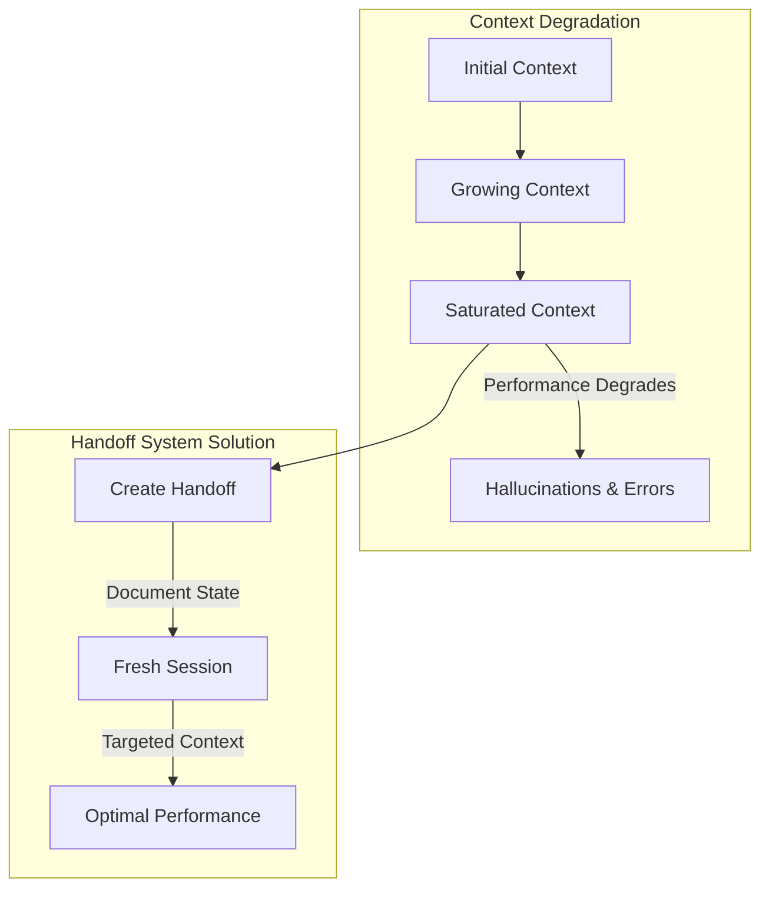
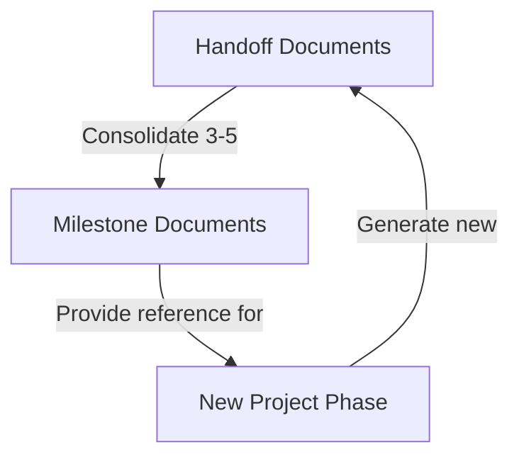
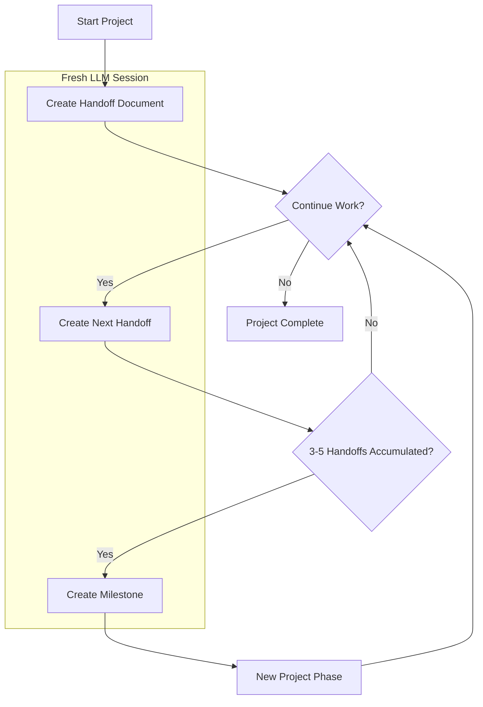
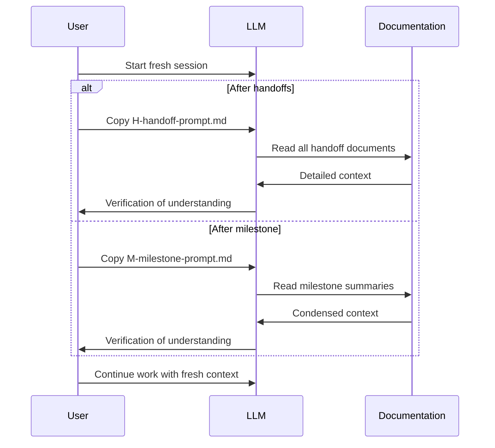
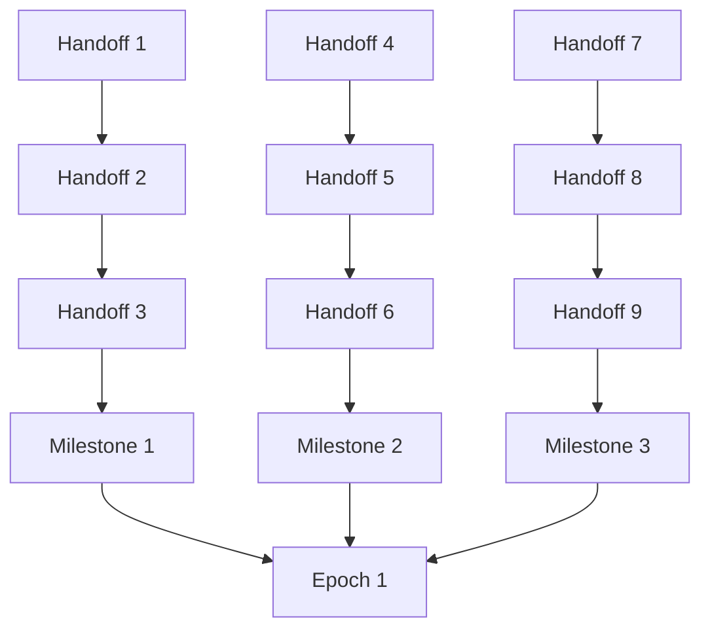
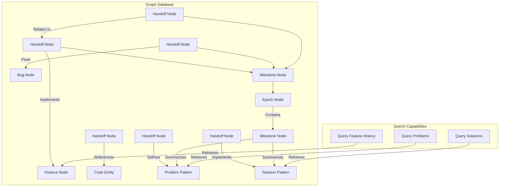

# The Handoff System

## Overview

The Handoff System is a structured knowledge management approach designed to optimize LLM performance across extended development sessions. By creating a seamless transition mechanism between LLM sessions, this system solves the fundamental problem of context window degradation while creating project development timeline documentation as a natural side effect.

**Implementation Guides:**
- [Basic Guide](handoff-system-basic.md) - Simple implementation that works with any LLM
- [Advanced Guide](handoff-system-advanced.md) - Enhanced implementation with Roo-Code custom modes

## The Challenge

As LLMs work on projects, they encounter several limitations:

1. **Context Window Saturation**: LLMs accumulate context that becomes increasingly bloated with irrelevant information
2. **Performance Degradation**: Extended sessions lead to reduced reasoning quality and increased hallucinations
3. **Token Consumption**: Larger contexts consume more tokens and increase costs
4. **Knowledge Continuity**: Starting fresh loses critical project understanding



Developers typically address these LLM limitations through memory bank solutions, which maintain project context in continuously updated files. This approach provides a current snapshot of the project state and recent decisions, which is valuable for ongoing development. However, as projects evolve, these systems face certain limitations: they actively condense information into fixed files, deliberately summarizing or removing details to maintain manageable file sizes; they focus primarily on current state rather than preserving the full developmental journey; and they have no guard rails to help prevent the LLM from repeating the same mistakes over and over. This active summarization often results in lost nuance and context that could be valuable later.

The Handoff System takes a different approach through chronological documentation. By creating discrete, sequential handoff documents and milestone summaries, it provides four main benefits: 1) it reduces token usage by creating write-once documents rather than requiring regeneration of entire context files, 2) it preserves development insights and lessons learned in their original, detailed form, 3) it enables selective loading of only the most relevant context based on current needs, and 4) it allows for rapidly spinning up fresh LLM sessions with precisely targeted context. Rather than actively condensing information, the system preserves everything but allows users to control which parts are loaded into context - effectively letting older information remain available but not consume tokens unless specifically needed.

## System Architecture

The Handoff System consists of two primary document types operating in a continuous cycle:



### 1. Handoff Documents

Sequential, numbered reports capturing development progress, stored in the project's `handoffs/` directory.

**Key characteristics:**
- Capture specific work completed in a session
- Document discoveries, problems, and solutions
- Flag work-in-progress items and priorities
- Provide chronological project history

*For details on handoff document format and structure, see [1-handoff-instructions.md](0-instructions/1-handoff-instructions.md) in your project after setup.*

### 2. Milestone Documents

Consolidated knowledge from multiple handoffs, created when significant project phases complete.

**Key characteristics:**
- Distill essential information from multiple handoffs
- Provide high-level project progress summaries
- Document lessons learned and best practices
- Store reusable patterns and solutions

*For details on milestone document format and structure, see [2-milestone-instructions.md](0-instructions/2-milestone-instructions.md) in your project after setup.*

### Directory Structure

#### Basic Structure

```
project/
├── handoffs/                   # Main handoff directory
│   ├── 0-instructions/         # System documentation (folders sort first)
│   │   ├── 0-intro.md
│   │   ├── 1-handoff-instructions.md
│   │   ├── 2-milestone-instructions.md
│   │   ├── H-handoff-prompt.md
│   │   ├── M-milestone-prompt.md
│   │   ├── create-handoff-prompt.md
│   │   └── create-milestone-prompt.md
│   │
│   ├── 1-feature-milestone/    # Milestone directory (numbered sequentially)
│   │   ├── 0-milestone-summary.md  # Consolidated milestone information
│   │   ├── 0-lessons-learned.md    # Key learnings
│   │   └── ...                 # Copies of related handoff documents
│   │
│   ├── 2-refactor-milestone/   # Next sequential milestone
│   │   ├── 0-milestone-summary.md
│   │   └── 0-lessons-learned.md
│   │
│   ├── 1-setup.md              # Sequential handoff documents
│   ├── 2-implementation.md     # Files are sorted after folders
│   ├── 3-bugfixes.md
│   ├── 4-feature-x.md
│   └── 5-refactoring.md
```

#### Advanced Structure (with Custom Modes)

```
project/
├── handoffs/                   # Main handoff directory
│   ├── .clinerules             # Main handoff system rules
│   ├── .clinerules-handoff-manager # Handoff-specific rules
│   ├── .clinerules-milestone-manager # Milestone-specific rules
│   ├── .roomodes               # Custom mode definitions
│   ├── 0-instructions/         # System documentation (all instruction files)
│   │   ├── 3-milestone-scripts.md  # Advanced scripting instructions
│   │   └── ... (Same as basic structure)
│   │
│   └── ... (Same milestone and handoff structure as basic)
```

*For step-by-step instructions on setting up this structure in your project, follow the [Basic Guide](handoff-system-basic.md) or [Advanced Guide](handoff-system-advanced.md).*

## Workflow Visualization

The system operates as a continuous cycle:



## Implementation Process

### When to Create Handoffs

Create handoff documents when:
- Completing a significant project segment
- Context becomes ~30% irrelevant to current task
- After 10+ conversation exchanges
- During debugging sessions exceeding 5 exchanges without resolution

### When to Create Milestones

Create milestone documents when:
- A major feature/component is fully implemented
- A significant project phase is completed
- 3-5 handoffs have accumulated
- Critical problems with valuable lessons have been solved
- The project reaches a stable/deployable state

### Knowledge Transfer Mechanism



When starting a new LLM session, use the prompt templates provided in the system:

- **For general continuation**: Use the `H-handoff-prompt.md` template to direct the LLM to read all handoff documents. This prompt ensures the LLM reads through the documents in the correct chronological order and reports back to verify understanding.

- **After milestone creation**: Use the `M-milestone-prompt.md` template to direct the LLM to read only the milestone summary documents (0-prefixed files in milestone directories).

These prompt templates serve as starting points that you can customize for your specific project needs. Consider modifying them to include:
- Project README files
- Documentation in docs/ directories
- API specifications
- Architecture diagrams
- Database schemas
- MCP server usage
- Other project-specific resources that provide important context

The key is to balance providing enough context for the LLM to be effective while avoiding unnecessary token consumption. The prompts have verification mechanisms built in to ensure the LLM properly processes the handoff/milestone documents.

*For implementation details and simplified prompts, refer to the [Basic Guide](handoff-system-basic.md) or [Advanced Guide](handoff-system-advanced.md).*

## Benefits

The Handoff System provides multiple advantages:

1. **Performance Optimization**: Maintain peak LLM reasoning by starting fresh when needed
2. **Cost Efficiency**: Reduce token consumption by eliminating redundant context
3. **Focused Development**: Keep attention on what matters most with clean context
4. **Debugging Breakthrough**: Break stubborn problems with "fresh eyes" perspective
5. **Automatic Documentation**: Generate project history as a natural side-effect
6. **Knowledge Preservation**: Retain critical insights between sessions
7. **Project Continuity**: Seamlessly transition between development phases

## Practical Applications

The system excels in scenarios like:

- **Complex, Long-Running Projects**: Maintain clarity across weeks of development
- **Team Collaboration**: Allow multiple developers to build on each other's work
- **Challenging Debug Sessions**: Break through stubborn issues with fresh perspective
- **Project Resumption**: Return to projects after extended breaks with minimal context loss
- **Token Optimization**: Reduce costs on projects with extensive context requirements

## Inspiration

This system draws inspiration from knowledge transfer protocols used in military intelligence operations, where information continuity between shifts is essential. These practical handoff techniques have been adapted to address the specific challenges that arise during extended LLM development sessions.

## Getting Started

### Basic Implementation

For a simple implementation that works with any LLM:

1. Create a `handoffs/` directory in your project
2. Copy the instruction templates from the `0-instructions/` directory
3. Begin documenting your development with handoff documents
4. Create milestone summaries at significant completion points
5. Use the provided prompts when switching to fresh LLM sessions

This lightweight implementation requires no special configuration and works with any LLM.

### Advanced Implementation with Custom Modes

For enhanced functionality, you can implement the handoff system with custom Roo-Code modes:

1. Complete the basic implementation steps
2. Copy the rule files (`.clinerules`, `.clinerules-handoff-manager`, `.clinerules-milestone-manager`, `.roomodes`) to your project's `handoffs/` directory
3. Use the specialized handoff-manager and milestone-manager modes when creating documentation

*For detailed, step-by-step implementation instructions, follow the [Basic Guide](handoff-system-basic.md) or [Advanced Guide](handoff-system-advanced.md).*

By implementing this system, you'll maintain optimal LLM performance throughout your project's lifecycle while generating valuable documentation that enhances collaboration and knowledge retention.

## Configuration Files (Advanced Implementation)

When using the advanced implementation with custom modes, the Handoff System uses these configuration files in the `handoffs/` directory:

- **`.clinerules`**: Main rules file that provides general guidance for creating handoffs and milestones
- **`.clinerules-handoff-manager`**: Specialized rules for the handoff manager mode
- **`.clinerules-milestone-manager`**: Specialized rules for the milestone manager mode
- **`.roomodes`**: Custom mode definitions for handoff and milestone management


## Future Improvements

The Handoff System has been designed with extensibility in mind. As development needs grow and projects become more complex, the architecture can naturally evolve to accommodate larger scales and longer timeframes.

### Epochs: A Third Tier for Complex Projects



For exceptionally complex projects, introducing "Epochs" as a third tier could further enhance the system's scalability. Epochs would represent major project eras - perhaps spanning multiple feature sets, version releases, or architectural paradigms. 

An epoch could collect and consolidate information from several related milestones, providing an ultra-high-level view of project evolution. This would allow LLMs to load only epoch-level summaries when broad historical context is needed, or drill down to milestone or handoff levels when more specific details are required.

The hierarchical structure would then flow naturally:
- **Handoffs**: Capture day-to-day progress and specific problem-solving details
- **Milestones**: Consolidate 3-5 handoffs into feature or phase summaries
- **Epochs**: Aggregate multiple milestones into major project chapters

This progression allows the knowledge management approach to scale infinitely with project complexity while maintaining the core principle of selective context loading that makes the Handoff System so efficient.

### Graph Database Integration



The hierarchical structure of the Handoff System naturally lends itself to graph database representation. While the current file-based approach is lightweight and effective, integrating with an embedded graph database like [Kùzu](https://github.com/kuzudb/kuzu) could significantly enhance knowledge retrieval capabilities.

Kùzu is an emerging embedded graph database management system that uniquely combines graph storage with vector embedding capabilities in a single integrated solution:
- It runs in-process with applications (similar to SQLite for relational databases)
- It handles both graph relationships and vector embeddings in one system
- It uses columnar storage and optimized query processing for high performance
- It supports native vector indexing and full-text search
- It maintains a small footprint while handling complex relationships

In a graph-enhanced Handoff System:
- Handoff documents would become nodes with relationships to code entities, decisions, and problems
- Milestones would function as aggregation nodes connecting multiple handoffs
- Epochs would serve as high-level organizational structures

This structure would enable powerful queries like "show all decisions related to the authentication system across milestones" or "identify recurring problems in the data processing pipeline" - questions that are difficult to answer with a traditional file system.

For older documents in past milestones, Kùzu's integrated vector embeddings could provide additional intelligence. By embedding the content of handoff and milestone documents, the system could quickly identify similar problems or solutions that occurred in the past, preventing teams from "reinventing the wheel" or repeating past mistakes. When a developer encounters an issue, semantic search against embedded historical documents could surface relevant precedents, even when terminology differs.

The combination of graph structure for relationship traversal and vector embeddings for semantic similarity would create a significantly smarter knowledge management system, enabling deeper insights and more intelligent connections between related concepts across the project timeline.

## Related Resources

- [Basic Implementation Guide](handoff-system-basic.md) - Simple implementation that works with any LLM
- [Advanced Implementation Guide](handoff-system-advanced.md) - Enhanced implementation with custom modes
- [Custom Modes Documentation](../cheatsheets/custom-modes-llm-instruction.md) - For setting up specialized handoff and milestone management modes
- [Large File Handling](../cheatsheets/llm-large-file-cheatsheet.md) - Complementary techniques for large files
- [Main Documentation](../README.md) - Overview of all Roo Code Tips & Tricks
